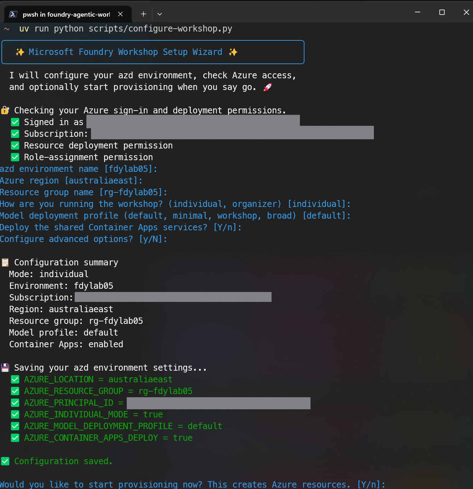

# Individual Guide

Individual mode lets a solo learner provision and run the entire workshop without an attendee
list or an organizer handoff. Set `AZURE_INDIVIDUAL_MODE=true` and run `azd provision` -
your own identity becomes the sole attendee.

For the abbreviated flow, see the [Individual Quickstart](./quickstart-individual.md).

## Prerequisites

| Prerequisite | Notes |
|---|---|
| Azure subscription | **Owner or Contributor** to create resources; **Owner or User Access Administrator** to assign roles |
| Foundry model quota | Check [quota limits](https://learn.microsoft.com/en-us/azure/foundry/foundry-models/quotas-limits) for your target region. When `AZURE_INDIVIDUAL_MODE=true`, the preprovision quota check defaults to the `default` profile (50 K TPM per model), which fits most subscriptions. Use `AZURE_MODEL_DEPLOYMENT_PROFILE=minimal` for lower-quota environments. |
| [Azure Developer CLI](https://learn.microsoft.com/azure/developer/azure-developer-cli/install-azd) | v1.11 or later |
| [Azure CLI](https://learn.microsoft.com/cli/azure/install-azure-cli) | v2.60 or later |
| [Python 3.13](https://www.python.org/downloads/) | Used by the provision hooks |
| [uv](https://docs.astral.sh/uv/getting-started/installation/) | Python package manager; all scripts and provision hooks run via `uv run` |
| [Docker Desktop](https://www.docker.com/products/docker-desktop/) | Required for MCP server image builds (skip by setting `AZURE_CONTAINER_APPS_DEPLOY=false`) |

## Set up the environment

1. Clone the repository.

   ```bash
   git clone https://github.com/PlagueHO/foundry-agentic-workshop.git
   cd foundry-agentic-workshop
   ```

1. Install Python dependencies.

   ```bash
   uv sync
   ```

1. Sign in to Azure.

   ```bash
   az login
   ```

### Using the setup wizard 🆕 (Recommended)

> [!TIP]
> 🆕 After signing in, run the interactive setup wizard to handle the remaining configuration and provisioning in one step. The wizard checks your Azure permissions, prompts for environment name, region, resource group, and model profile, then optionally starts provisioning.

```bash
uv run python scripts/configure-workshop.py
```

<details>
<summary>📸 Screenshot: configure-workshop wizard in individual mode</summary>


*The wizard checks your Azure access, prompts for all settings, writes the azd environment variables, and optionally starts provisioning.*

</details>

If provisioning completed in the wizard, skip to [project naming](#project-naming).

### Manual configuration (fallback)

1. Create the azd environment and configure variables.

   > [!NOTE]
   > Environment names must be 16 characters or fewer, contain only lowercase letters, digits, and hyphens, and must not begin or end with a hyphen. Azure resource names are derived from this value.

   ```bash
   azd env new my-foundry-lab
   azd env set AZURE_LOCATION australiaeast
   azd env set AZURE_RESOURCE_GROUP rg-foundry-lab
   azd env set AZURE_INDIVIDUAL_MODE true
   ```

   Replace `australiaeast` with a region that has sufficient Foundry model quota, and choose a
   resource group name that is unique in your subscription.

1. Run `azd provision`. The provision hooks run automatically.

| Hook | What happens in individual mode |
|---|---|
| Pre-provision (`prepare-attendee-roles.py`) | Reads your signed-in UPN from `az account show` and derives the Foundry project name. |
| Post-provision (`generate-attendee-onboarding.py`) | Writes your environment configuration to `.env`. |

```bash
azd provision
```

## Project naming

Your Foundry project name is derived from your signed-in UPN local part (the text before `@`),
with `.` and `_` replaced by `-`, lowercased, and truncated to 32 characters.

For example: `jane.doe@contoso.com` → `jane-doe`

If the UPN cannot be retrieved, the project name falls back to `attendee-01`.

## After provisioning

1. Review `.env`. This file is overwritten each time you re-provision.

1. Validate your setup.

   ```bash
   uv run python scripts/health-check.py
   ```

1. Open the [Microsoft Foundry portal](https://ai.azure.com) and confirm your project appears.

1. Begin the labs. Start with
   [Lab 01 – Setup](./lab-steps/introduction-foundry-agent-service/01-setup.md).

## Tear down

Remove all provisioned resources when you are done.

```bash
azd down --force --purge
```

## Troubleshooting

### Insufficient model quota

During provisioning, Azure returns an error similar to the following when the target region does
not have enough quota for the requested model:

```text
This operation require 200 new capacity in quota One Thousand Tokens Per Minute
- gpt-5.4-mini - GlobalStandard, which is bigger than the current available capacity 0.
The current quota usage is 0 and the quota limit is 0 for quota One Thousand Tokens
Per Minute - gpt-5.4-mini - GlobalStandard. (Code: InsufficientQuota)
```

This means the subscription has no allocated quota for that model and SKU tier in the selected
region. The `default` profile requests 50 K TPM for each of its model deployments, which
exceeds the quota limit of zero shown above.

#### Check available quota

Run the quota viewer to inspect what capacity is available in your target region:

```bash
uv run python scripts/show-model-quota.py --location australiaeast --provider openai
```

Replace `australiaeast` with your chosen region. Each row shows the quota limit, current usage,
and remaining TPM. Look for the `gpt-5.4-mini` row under the `GlobalStandard` SKU.

To scan the default candidate regions and show only entries that have remaining capacity:

```bash
uv run python scripts/show-model-quota.py --filter gpt-5.4-mini --available-only
```

Once you find a region with sufficient quota, switch to it and re-provision:

```bash
azd env set AZURE_LOCATION <region>
azd provision
```

#### Switch to a smaller model profile

The `default` profile requests 50 K TPM per model. If your subscription has lower quota limits,
switch to the `minimal` profile (10 K TPM) instead:

```bash
azd env set AZURE_MODEL_DEPLOYMENT_PROFILE minimal
azd provision
```

#### Reduce capacity manually

If neither a region change nor a built-in profile resolves the shortfall, edit
`infra/model-deployments.default.json` and lower the `capacity` values to fit your available
quota. The `capacity` field is measured in thousands of tokens per minute (K TPM).

```json
{
  "name": "chat",
  "model": { "format": "OpenAI", "name": "gpt-5.4-mini", "version": "2026-03-17" },
  "sku": {
    "name": "GlobalStandard",
    "capacity": 10
  }
}
```

Reduce `capacity` for every deployment entry in the file, then run `azd provision`.

> [!NOTE]
> The `check-model-quota.py` script runs automatically as a pre-provision hook and prints a
> detailed shortfall table when quota is insufficient. Run it manually at any time to preview
> the result without provisioning:
>
> ```bash
> uv run python scripts/check-model-quota.py
> ```
