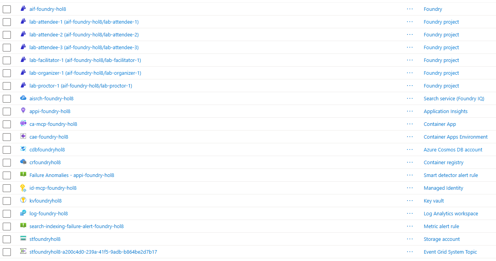
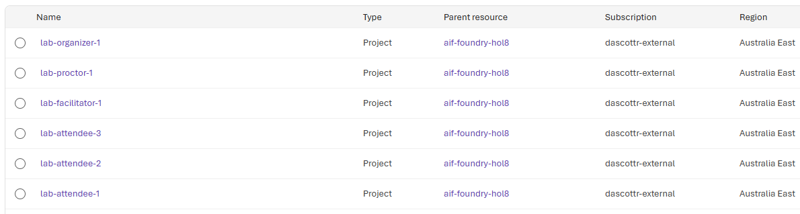
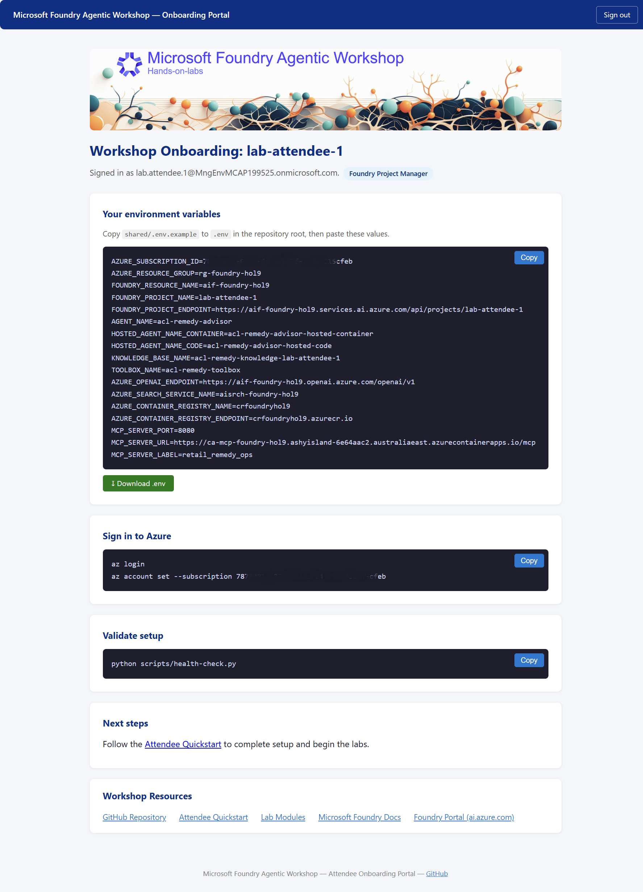

# Organizer Guide

This guide covers standing up and tearing down a shared Microsoft Foundry workshop environment: infrastructure deployment, per-attendee access, validation, and cleanup. For the condensed checklist, see the [Organizer Quickstart](./quickstart-organizer.md).

## Prerequisites

1. An Azure subscription to use to host the laboratory infrastructure where you have permission to create resources and assign roles.
   1. To create resources requires requires Owner or Contributor role on the subscription or resource group.
   1. To assign roles requires Owner or User Access Administrator on the subscription or resource group.
1. [Azure Developer CLI](https://learn.microsoft.com/azure/developer/azure-developer-cli/install-azd).
1. [Azure CLI](https://learn.microsoft.com/cli/azure/install-azure-cli).
1. [Docker](https://www.docker.com/) running locally. Provisioning uses it to build and publish the shared MCP server image to Azure Container Apps (only needed when `AZURE_CONTAINER_APPS_DEPLOY` is `true`, the default).
1. Python 3.13 or later (the pre-provision hook resolves attendee UPNs to Microsoft Entra object IDs before Bicep assigns roles).
1. [uv](https://docs.astral.sh/uv/getting-started/installation/) - the `azd provision` hooks run all scripts via `uv run`.
1. [Foundry Model quota](https://learn.microsoft.com/en-us/azure/foundry/foundry-models/quotas-limits) in your target region for the models the labs use. The default organizer profile (`workshop`) requires capacity for `chat` (200), `embedding` (200), and `gpt54mini` (200). Use `AZURE_MODEL_DEPLOYMENT_PROFILE=default` (50 each) for lower-quota environments, or `minimal` to drop the `gpt54mini` deployment. The preprovision quota check validates this automatically.
1. The Microsoft Entra ID UPN for each attendee, organizer, facilitator and proctor. The organizer, facilitator and proctors are optional.

## Typical workshop setup

This section walks through the most common scenario: a handful of standard attendees and one facilitator. The whole flow takes about five minutes. A single command - `azd provision` - deploys the Azure resources and assigns all roles; re-run it any time the roster changes.

> [!NOTE]
> 🆕 An interactive setup wizard (`scripts/configure-workshop.py`) is available. Organizer mode — including `AZURE_ATTENDEE_LIST` configuration in the wizard — has not yet been fully tested. Manual configuration (steps 3–5 below) remains the recommended approach for organizer deployments. The wizard can handle basic environment and region setup, but set `AZURE_ATTENDEE_LIST` manually as described in step 4.

### 1. Clone the repository

```bash
git clone https://github.com/PlagueHO/foundry-agentic-workshop.git
cd foundry-agentic-workshop
```

### 2. Sign in

Authenticate both CLIs against the subscription where you hold Owner or User Access
Administrator rights.

```bash
az login
```

> [!INFORMATION]
> Azure Developer CLI is used to provision the infrastructure and Azure CLI is used to assign roles to the Azure services and populate the lab data into the Azure services.

### 3. Create an environment

Create an isolated azd environment to hold your workshop configuration. This also sets the
Azure region and resource group.

> [!NOTE]
> Environment names must be 16 characters or fewer, contain only lowercase letters, digits, and hyphens, and must not begin or end with a hyphen. Azure resource names are derived from this value.

```bash
azd env new my-workshop
azd env set AZURE_LOCATION australiaeast
azd env set AZURE_RESOURCE_GROUP rg-my-workshop
```

### 4. Set your attendee list

`AZURE_ATTENDEE_LIST` is the single configuration variable that drives project creation. Set it to a single-line JSON array of attendees before provisioning. The pre-provision hook resolves each UPN to a Microsoft Entra object ID and emits `AZURE_ATTENDEE_LIST_RESOLVED`; Bicep reads that resolved list to create all RBAC role assignments at deploy time.

The example below registers five standard attendees and one facilitator. By default, each attendee's project is named after the local part of their UPN (for example `alice`, `bob`, and `facilitator`); see the tip below if you prefer sequential names such as `attendee-01`.

```bash
azd env set AZURE_ATTENDEE_LIST '[{"upn":"alice@contoso.com"},{"upn":"bob@contoso.com"},{"upn":"carol@contoso.com"},{"upn":"david@contoso.com"},{"upn":"eve@contoso.com"},{"upn":"facilitator@contoso.com","role":"facilitator"}]'
```

The default role for entries without an explicit `role` is `foundry-project-manager`, which is recommended for lab deployments as it covers all workshop modules. You can set a lower role with `AZURE_ATTENDEE_DEFAULT_ROLE=foundry-user`, but attendees will not be able to complete Module 07 (Foundry IQ) or Module 12 (Publishing Agents). The `facilitator` role grants full account-level access.

<!-- markdownlint-disable MD028 -->
> [!TIP]
> Store the formatted version in a local file for readability and paste the single-line form into `azd env set`. See [Scenario examples](#scenario-examples) for more roster patterns.

> [!TIP]
> By default, each attendee's Foundry project is named from the local part of their UPN - for example `alice.smith@contoso.com` becomes `alice-smith`. Dots and underscores are replaced with hyphens and the name is lowercased and capped at 32 characters. Set `AZURE_USE_UPN_PROJECT_NAMES=false` to revert to sequential `<prefix>-NN` names (for example `attendee-01`).
<!-- markdownlint-enable MD028 -->

### 5. Provision

```bash
azd provision
```

> [!NOTE]
> Every Foundry project's system-assigned managed identity is automatically granted the **Reader** role on the workshop's Application Insights component so the project can read agent traces in the Foundry portal. This assignment is always created for every project and requires no configuration. Without it, the portal reports "Setup incomplete: Assign the Foundry project's managed identity the Reader role on Application Insights to access traces."

This single command runs three stages automatically:

1. **Resolve attendees** - `scripts/prepare-attendee-roles.py` (pre-provision) maps each UPN to a Microsoft Entra object ID and computes project names. It writes an audit to `.azure/<env>/attendee-resolution-<env>-<timestamp>.csv`.
1. **Deploy infrastructure** - Bicep creates all Azure resources with attendee role assignments embedded.
1. **Onboard and seed** - `scripts/generate-attendee-onboarding.py` (post-provision) writes a per-attendee onboarding file to `.azure/<env>/<upn_local>.md`, a provisioning summary to `.azure/<env>/attendee-provisioning-<env>-<timestamp>.csv`, seeds the Azure AI Search indexes, and publishes the shared MCP server.

Re-run `azd provision` any time you change `AZURE_ATTENDEE_LIST`, `AZURE_ATTENDEE_COUNT`, or the project prefix.

> [!TIP]
> The shared **Retail Remedy Operations** MCP server for [Module 06](./lab-steps/introduction-foundry-agent-service/06-mcp-tools.md) and subsequent modules is published for you during provisioning, and its URL is saved into every attendee onboarding file as `RETAIL_REMEDY_OPS_MCP_SERVER_URL` - attendees use it without running anything locally. This step needs **Docker** running and a signed-in **Azure CLI**. To skip the shared server and have attendees tunnel their own copy instead, run `azd env set AZURE_CONTAINER_APPS_DEPLOY false` before provisioning.

<details>
<summary>📸 Screenshot: Azure Portal showing the deploy resources</summary>


  *The Azure portal showing the deployed Foundry account and projects, one per attendee as well as the other supporting resources.*

</details>

## Validate and share

After provisioning, confirm the environment is healthy and share connection details with
attendees.

### Confirm projects

```bash
azd env get-value AZURE_ATTENDEE_PROJECT_NAMES
```

Open the [Foundry portal](https://ai.azure.com) and confirm the projects and model deployments exist. Optionally sign in as a test attendee to verify the expected capabilities.

<details>
<summary>📸 Screenshot: The project list in the Foundry portal</summary>


  *The Foundry Projects list showing one project per attendee.*

</details>

### Share with attendees

After provisioning, share the **Attendee Portal URL** with all attendees.

```bash
azd env get-value ATTENDEE_PORTAL_URL
```

Attendees visit the portal URL, sign in with their lab Microsoft account, and immediately see their personal `.env` configuration, sign-in commands, and validation steps - no file distribution required. A single URL covers all attendees.

<details>
<summary>📸 Screenshot: Attendee portal showing environment variables and setup steps</summary>



</details>

#### How the portal works

The portal is an authenticated Azure Container Apps web application backed by Container Apps built-in EasyAuth (Entra ID single-tenant). On sign-in, EasyAuth validates the attendee's Entra ID token and injects identity claims into each request. The portal reads the attendee's UPN from those claims to look up their record in the `index.json` blob stored in the shared Azure Storage account and renders a personalised page containing:

- **Your environment variables** - all `.env` values in a copyable code block, plus a **Download .env** button to save the file directly.
- **Sign in to Azure** - `az login` and `az account set` commands pre-populated with the workshop subscription ID.
- **Validate setup** - the `uv run python scripts/health-check.py` command ready to copy.
- **Next steps** - a link to the Attendee Quickstart to complete setup.
- **Workshop Resources** - links to the GitHub repo, lab modules, and Microsoft Foundry documentation.
- A role badge showing the attendee's assigned Foundry role.
- A **Sign out** button.

The `index.json` blob is written by `scripts/generate-attendee-onboarding.py` during the post-provision step. Each record includes the attendee's env vars as a key-value map, `roleDisplayName`, and a `resolved` flag. A `_meta` key records the generation timestamp and total/resolved counts.

#### Portal troubleshooting

| Symptom | Likely cause | Fix |
|---------|-------------|-----|
| Portal shows "No configuration found" | `index.json` not yet uploaded | Re-run `azd provision` or run `python scripts/generate-attendee-onboarding.py` manually after setting required env vars. |
| Portal redirects to login then returns 401 | EasyAuth misconfigured | Run `python scripts/deploy-attendee-portal.py` to re-apply the EasyAuth configuration. |
| Portal shows a role badge of blank | `index.json` predates the `roleDisplayName` field | Re-run `azd provision` to regenerate `index.json`. |
| Attendee sees another attendee's config | UPN key collision | Unlikely - keys are derived from the local part of the UPN. File a bug if seen. |

#### Markdown backups

Per-attendee markdown files are written locally to `.azure/<env>/<upn_local>.md` **and** uploaded as backup blobs to `<upn_local>.md` in the `attendee-onboarding` Storage container. Use them as a fallback if the portal is unavailable, for offline distribution, or for audit purposes.

> [!TIP]
> Files are written to `.azure/<env>/<upn_local>.md` where `<env>` is the azd environment name and `<upn_local>` is the local part of the attendee's UPN. For example, `alice.smith@contoso.com` in environment `my-workshop` produces `.azure/my-workshop/alice-smith.md` and the blob `alice-smith.md`.

Refer attendees to the [Attendee Quickstart](./quickstart-attendee.md) for setup instructions.

---

## Attendee list reference

`AZURE_ATTENDEE_LIST` is a single-line JSON array persisted by `azd env set` and read by
both the Bicep deployment (project creation) and the pre-provision hook (UPN resolution). Set it before provisioning. The pre-provision hook enriches each entry with an Entra object ID and writes the result to `AZURE_ATTENDEE_LIST_RESOLVED`; Bicep then creates all RBAC role assignments from that resolved list.

The full JSON schema is at `shared/schemas/attendee-list.schema.json`.

### Fields

| Field | Required | Default | Purpose |
|-------|----------|---------|---------|
| `upn` | Yes |- | Microsoft Entra UPN; resolved to an object ID at provisioning time. |
| `role` | No | `AZURE_ATTENDEE_DEFAULT_ROLE` | Role key- see [Role catalog](#role-catalog). |
| `individualProject` | No | `true` | `true` = dedicated project; `false` = shares the first project in the list. |
| `projectName` | No | UPN local part or `<prefix>-NN` | Explicit project name (lowercase alphanumeric, hyphens, 2–64 chars). Takes priority over `AZURE_USE_UPN_PROJECT_NAMES`. |

### Scenario examples

**Anonymous projects- headcount only**

Use this when you have a seat count but no UPN list yet. Creates five blank projects with no role assignments. Switch to a named list once UPNs are available.

```bash
azd env set AZURE_ATTENDEE_COUNT 5
```

When `AZURE_ATTENDEE_LIST` is also set, it always takes precedence. Unset it first if you
want to switch back to the anonymous count mode.

---

**Standard attendees**

All attendees receive `foundry-user` (least privilege) and a dedicated `attendee-NN` project.

```json
[
  {"upn":"alice@contoso.com"},
  {"upn":"bob@contoso.com"},
  {"upn":"carol@contoso.com"}
]
```

```bash
azd env set AZURE_ATTENDEE_LIST '[{"upn":"alice@contoso.com"},{"upn":"bob@contoso.com"},{"upn":"carol@contoso.com"}]'
```

---

**Standard attendees with a facilitator**

The facilitator gets `Foundry Owner` at account scope and a `facilitator-01` project. Standard attendees are unaffected.

```json
[
  {"upn":"alice@contoso.com"},
  {"upn":"bob@contoso.com"},
  {"upn":"carol@contoso.com"},
  {"upn":"facilitator@contoso.com","role":"facilitator"}
]
```

---

**Workshop staff- facilitator, proctor, organizer**

Each staff role receives a project under its own prefix. Attendees and staff are numbered
independently, so `attendee-01`, `facilitator-01`, and `proctor-01` are distinct projects.

```json
[
  {"upn":"alice@contoso.com"},
  {"upn":"bob@contoso.com"},
  {"upn":"facilitator@contoso.com","role":"facilitator"},
  {"upn":"proctor@contoso.com","role":"proctor"},
  {"upn":"organizer@contoso.com","role":"organizer"}
]
```

---

**Mixed privilege levels**

Give specific attendees elevated roles while keeping everyone else on `foundry-user`.

```json
[
  {"upn":"alice@contoso.com"},
  {"upn":"bob@contoso.com","role":"foundry-project-manager"},
  {"upn":"carol@contoso.com","role":"foundry-account-owner"}
]
```

---

**Team projects**

Multiple attendees share a project by specifying the same `projectName`. Duplicates are
removed so only one project is created per unique name.

```json
[
  {"upn":"alice@contoso.com","projectName":"team-red"},
  {"upn":"bob@contoso.com","projectName":"team-red"},
  {"upn":"carol@contoso.com","projectName":"team-blue"},
  {"upn":"david@contoso.com","projectName":"team-blue"}
]
```

---

**Updating an existing roster**

Update `AZURE_ATTENDEE_LIST` and re-run `azd provision`. Existing projects are preserved;
new entries get projects and role assignments; role changes are applied.

```json
[
  {"upn":"alice@contoso.com","role":"foundry-project-manager"},
  {"upn":"bob@contoso.com"},
  {"upn":"new-attendee@contoso.com"}
]
```

### Validate before provisioning

Use `check-jsonschema` to catch typos and invalid role keys before provisioning:

```bash
azd env get-value AZURE_ATTENDEE_LIST > /tmp/attendee-list.json
uvx check-jsonschema --schemafile shared/schemas/attendee-list.schema.json /tmp/attendee-list.json
```

## Role catalog

Role keys map to Foundry built-in roles. See [Role-based access control for Microsoft Foundry](https://learn.microsoft.com/en-us/azure/foundry/concepts/rbac-foundry).

| Role key | Foundry role | Scope | Can | Cannot |
|----------|--------------|-------|-----|--------|
| `foundry-user` | Foundry User | Project | Build agents, create connections, use deployed models, and toolboxes. | Deploy models, publish agents, create Foundry IQ knowledge bases. |
| `foundry-project-manager` | Foundry Project Manager | Account | Everything above plus publish agents and create Foundry IQ knowledge bases. **Recommended default for lab deployments.** | Deploy models. |
| `foundry-account-owner` | Foundry Account Owner | Account | Everything above plus deploy models. |- |
| `foundry-owner` | Foundry Owner | Account | Full build and manage. |- |
| `facilitator` | Foundry Owner | Account | Full access under the facilitator project prefix. |- |
| `proctor` | Foundry Owner | Account | Full access under the proctor project prefix. |- |
| `organizer` | Foundry Owner | Account | Full access under the organizer project prefix. |- |

`foundry-project-manager` is the recommended default for lab deployments. It covers all workshop modules, including Module 07 (Foundry IQ) and Module 12 (Publishing Agents). Because the organizer pre-deploys models during provisioning, attendees do not need the `foundry-account-owner` role to deploy models themselves.

You can set a more restrictive default for environments where those modules are not used:

```bash
# Restrict to least privilege (Module 07 and Module 12 will not be completable)
azd env set AZURE_ATTENDEE_DEFAULT_ROLE foundry-user

# Elevate to allow model deployment
azd env set AZURE_ATTENDEE_DEFAULT_ROLE foundry-account-owner

# Or set roles individually per attendee
azd env set AZURE_ATTENDEE_LIST '[{"upn":"alice@contoso.com","role":"foundry-account-owner"},{"upn":"bob@contoso.com"}]'
```

### Staff project prefixes

Staff roles use their own prefix and are numbered independently of standard attendees. A `facilitator-01` project is always provisioned by default even when no facilitator appears in `AZURE_ATTENDEE_LIST` (controlled by `AZURE_ENSURE_FACILITATOR_PROJECT`).

| Role | Default prefix | Env var | Example project |
|------|---------------|---------|-----------------|
| Standard attendee | `attendee` | `AZURE_ATTENDEE_PROJECT_PREFIX` | `attendee-01` |
| `facilitator` | `facilitator` | `AZURE_FACILITATOR_PROJECT_PREFIX` | `facilitator-01` |
| `proctor` | `proctor` | `AZURE_PROCTOR_PROJECT_PREFIX` | `proctor-01` |
| `organizer` | `organizer` | `AZURE_ORGANIZER_PROJECT_PREFIX` | `organizer-01` |

Override any prefix with `azd env set <VAR> <value>` before provisioning.

## Provisioning audit

### Pre-provision: UPN resolution audit

Before deployment begins, `scripts/prepare-attendee-roles.py` writes a resolution audit and
prints a summary.

File: `./.azure/attendee-resolution-<env>-<timestamp>.csv`

| Column | Meaning |
|--------|---------|
| `upn` | Attendee UPN. |
| `object_id` | Resolved Microsoft Entra object ID, or empty if resolution failed. |
| `project_name` | Precomputed Foundry project name. |
| `role` | Effective role key (default applied). |
| `individual_project` | Whether a dedicated project is created. |
| `resolved` | `True` when the UPN resolved successfully. |
| `message` | Failure detail when `resolved` is `False`. |

Review unresolved entries before the workshop starts. The most common cause is a UPN that does not exist in the tenant or a guest account not yet accepted their invitation.

### Post-provision: provisioning summary

After deployment, `scripts/generate-attendee-onboarding.py` writes a per-attendee onboarding
markdown file (`.azure/<env>/<upn_local>.md`) and a provisioning summary CSV.

File: `./.azure/attendee-provisioning-<env>-<timestamp>.csv`

| Column | Meaning |
|--------|---------|
| `upn` | Attendee UPN. |
| `object_id` | Microsoft Entra object ID used for role assignment by Bicep. |
| `role_key` | Role key requested. |
| `role_display_name` | Foundry role display name. |
| `role_definition_id` | Azure role definition GUID. |
| `project_name` | Target project, or empty for account-scoped roles. |
| `scope` | `project`, `account`, `resource-group`, or `search`. |
| `status` | `succeeded` (Bicep assigned the role) or `failed` (UPN not resolved). |
| `message` | Failure detail when `status` is `failed`. |

## Teardown

```bash
azd down --force --purge
```

This removes the resource group and purges soft-deleted Foundry and Key Vault resources so
the names are immediately reusable.

## Troubleshooting

### Insufficient model quota

During provisioning, Azure returns an error similar to the following when the target region does
not have enough quota for the requested model:

```text
This operation require 200 new capacity in quota One Thousand Tokens Per Minute
- gpt-5.4-mini - GlobalStandard, which is bigger than the current available capacity 0.
The current quota usage is 0 and the quota limit is 0 for quota One Thousand Tokens
Per Minute - gpt-5.4-mini - GlobalStandard. (Code: InsufficientQuota)
```

This means the subscription has no allocated quota for that model and SKU tier in the selected
region. The `workshop` profile requests 200 K TPM for each of its three model deployments
(`chat`, `embedding`, `gpt54mini`). That capacity is shared across all concurrent workshop
attendees, so a higher limit than the individual profile is intentional.

#### Check available quota

Run the quota viewer to inspect what capacity is available in your target region:

```bash
uv run python scripts/show-model-quota.py --location australiaeast --provider openai
```

Replace `australiaeast` with your chosen region. Each row shows the quota limit, current usage,
and remaining TPM. Look for the `gpt-5.4-mini` row under the `GlobalStandard` SKU and confirm
at least 200 K TPM is available.

To scan the default candidate regions and show only entries that have remaining capacity:

```bash
uv run python scripts/show-model-quota.py --filter gpt-5.4-mini --available-only
```

Once you find a region with sufficient quota, switch to it and re-provision:

```bash
azd env set AZURE_LOCATION <region>
azd provision
```

#### Switch to a smaller model profile

If the `workshop` profile exceeds available quota, switch to `default` (50 K TPM per model,
all three deployments retained):

```bash
azd env set AZURE_MODEL_DEPLOYMENT_PROFILE default
azd provision
```

For the most constrained environments, switch to `minimal` (50 K TPM, drops the `gpt54mini`
deployment — attendees can still use the `chat` deployment for those labs):

```bash
azd env set AZURE_MODEL_DEPLOYMENT_PROFILE minimal
azd provision
```

#### Reduce capacity manually

If no built-in profile fits your available quota and you cannot change region, edit
`infra/model-deployments.workshop.json` and lower the `capacity` values to fit your available
quota. The `capacity` field is measured in thousands of tokens per minute (K TPM).

```json
{
  "name": "chat",
  "model": { "format": "OpenAI", "name": "gpt-5.4-mini", "version": "2026-03-17" },
  "sku": {
    "name": "GlobalStandard",
    "capacity": 100
  }
}
```

Reduce `capacity` for every deployment entry in the file, then run `azd provision`.

> [!NOTE]
> The `check-model-quota.py` script runs automatically as a pre-provision hook and prints a
> detailed shortfall table when quota is insufficient. Run it manually at any time to preview
> the result without provisioning:
>
> ```bash
> uv run python scripts/check-model-quota.py
> ```
