Self-paced and facilitator-led hands-on-labs for agentic applications with [Microsoft Foundry](https://learn.microsoft.com/azure/ai-foundry/what-is-foundry) and [Microsoft Agent Framework](https://aka.ms/agentframework).

## Jump in

Not sure where to start? Pick your situation:

- 🧑‍💻 **Learning solo (no team, no attendee list)?** Use individual mode to provision your own environment with a single command. Start with the [Individual Quickstart](./quickstart-individual.md).
- 🏗️ **Organizing a lab for your team?** You need to provision the shared Azure environment before anyone can attend. Start with the [Organizer Quickstart](./quickstart-organizer.md).
- 🎓 **Attending a lab someone has set up for you?** Your organizer will send you connection details. Start with the [Attendee Quickstart](./quickstart-attendee.md).
- 🎤 **Delivering the session live as a facilitator?** Start with the [Facilitator Quickstart](./quickstart-facilitator.md).
- 🔍 **Not sure which lab to do?** Browse [Available labs](#available-labs) below and pick a series that matches your goals.
- 🤔 **Not sure which role you have?** Read the [Roles](#roles) section below - most people are either an organizer or an attendee.

## Available labs

Labs are organized by series. Work through each lab in sequence within a series; every lab is independently runnable so you can resume at any point.

| Lab series | Description | Modules | Total time |
|------------|-------------|---------|------------|
| [Introduction to Foundry Agent Service](./labs/introduction-foundry-agent-service.md) | Build a production-grade agent from first principles: prompt agents, tools and evaluations, MCP tools, Foundry IQ, the Python Agent Framework, hosted agents, Foundry Toolboxes, Agent Ops, and Agent ID. | 12 | ~3–4 hours |
| [Introduction to Microsoft Agent Framework (.NET)](./labs/agent-framework-dotnet.md) | Build agentic .NET applications end-to-end: first agent, multi-turn, function tools, MCP tools, knowledge bases, memory, chat history, multi-agent orchestration, hosted agents, auth, observability, Agent Harness, evaluation, and Agent-to-Agent (A2A). | 15 | ~5–6 hours |

## Roles

Each workshop delivery involves up to four roles. Only the organizer and attendee are required.

### Organizer (required)

The organizer provisions the shared Azure environment before the workshop, assigns each attendee a dedicated Foundry project, shares connection details, and tears everything down afterwards. Organizers need an Azure subscription with sufficient [Foundry model quota](https://learn.microsoft.com/azure/foundry/foundry-models/quotas-limits) and permission to create resources and assign roles.

### Attendee (required)

Attendees complete the labs using the shared Foundry environment their organizer provisions. The organizer pre-deploys models and creates a dedicated project for each attendee, so attendees focus entirely on building agents.

### Facilitator (optional)

The facilitator delivers the session live, introduces each lab, manages pacing and time-boxes, and works with proctors to keep every attendee productive. Before the session the facilitator runs through all labs on a test identity to verify the environment.

### Proctor (optional)

Proctors provide 1:1 floor support during delivery so the facilitator can keep teaching without interruption. They triage individual attendee issues, help people who fall behind, and escalate only when a problem affects multiple attendees.

## Start here

Pick the path that matches your role.

| Role | Required | Start with | Then read |
|------|----------|------------|----------|
| Organizer | Yes | [Organizer Quickstart](./quickstart-organizer.md) | [Organizer Guide](./guide-organizer.md) |
| Individual learner | - | [Individual Quickstart](./quickstart-individual.md) | [Individual Guide](./guide-individual.md) |
| Attendee | Yes | [Attendee Quickstart](./quickstart-attendee.md) | [Attendee Guide](./guide-attendee.md) |
| Facilitator | No | [Facilitator Quickstart](./quickstart-facilitator.md) | [Facilitator Guide](./guide-facilitator.md) |
| Proctor | No | [Proctor Guide](./guide-proctor.md) | - |
