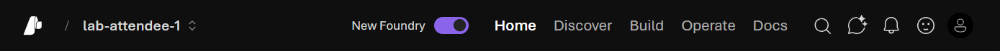

# Attendee Quickstart

Use this quickstart when your organizer has already provisioned shared workshop
infrastructure. It is the high-level flow; see the [Attendee Guide](./guide-attendee.md) for
detailed setup and troubleshooting.

## Prerequisites

1. [VS Code Insiders](https://code.visualstudio.com/insiders/) with the [Foundry Toolkit for VS Code](https://marketplace.visualstudio.com/items?itemName=ms-windows-ai-studio.windows-ai-studio).
1. [Python 3.13 or later](https://www.python.org/downloads/).
1. [uv](https://docs.astral.sh/uv/getting-started/installation/).
1. [Azure CLI](https://learn.microsoft.com/cli/azure/install-azure-cli).
1. [Azure Developer CLI](https://learn.microsoft.com/azure/developer/azure-developer-cli/install-azd).
1. [Docker](https://www.docker.com/products/docker-desktop/) (optional) - required only for [Module 09](./labs/introduction-foundry-agent-service) Part 1, which deploys a hosted agent from a container image. Every other module, including Module 09 Part 2 (deploy from source code), runs without it.
1. [.NET 10 SDK](https://dotnet.microsoft.com/download/dotnet/10.0) (optional) - required only for the Agent Framework for .NET lab series.
1. Microsoft 365 Agents Toolkit CLI (`atk`) (optional) - used only for [Module 13](./lab-steps/introduction-foundry-agent-service/13-custom-engine-agent); manual Teams app upload is also supported.
1. Your assigned project information from your organizer.

## Clone the repository

```bash
git clone https://github.com/PlagueHO/foundry-agentic-workshop.git
cd foundry-agentic-workshop
```

## Install dependencies

```bash
uv sync
```

## Get your environment configuration

Your organizer provides an **Attendee Portal URL**. Visit it, sign in with your lab
Microsoft account, and follow the instructions on the page. The portal shows:

- Your personal `.env` values in a copyable code block, plus a **Download .env** button to save the file directly.
- Pre-populated `az login` and `az account set` commands for the workshop subscription.
- The `uv run python scripts/health-check.py` validation command.

Module 13 is optional extra credit. Its hands-on path uses your own Azure subscription
and Microsoft Entra tenant because the shared workshop tenant does not grant permission
to create the required app registration and Azure Bot Service resource.

If the portal is unavailable, copy the values from the onboarding file your organizer sent:

1. Copy `shared/.env.example` to `.env`.
1. Populate these values from your assignment:
   - `AZURE_SUBSCRIPTION_ID`
   - `AZURE_RESOURCE_GROUP`
   - `FOUNDRY_RESOURCE_NAME`
   - `FOUNDRY_PROJECT_NAME`
   - `FOUNDRY_PROJECT_ENDPOINT`
   - `AZURE_OPENAI_ENDPOINT`
   - `AZURE_SEARCH_SERVICE_NAME`

## Sign in

```bash
az login
```

## Validate setup

```bash
uv run python scripts/health-check.py
```

## Open your project

> [!IMPORTANT]
> All labs use the **New Foundry** experience. Enable the **New Foundry** toggle in the top navigation bar before starting.

1. Sign in to the [Foundry portal](https://ai.azure.com).
1. Enable the **New Foundry** toggle in the top navigation bar if it is not already on.

   

1. When prompted, select the project named in your `FOUNDRY_PROJECT_NAME` from the dropdown and select **Let's go**.

## Start the labs

Open the [available labs](./labs/introduction-foundry-agent-service) in the docs and begin with the first lab in the series. Each lab is independently runnable, so you can resume at any point.
