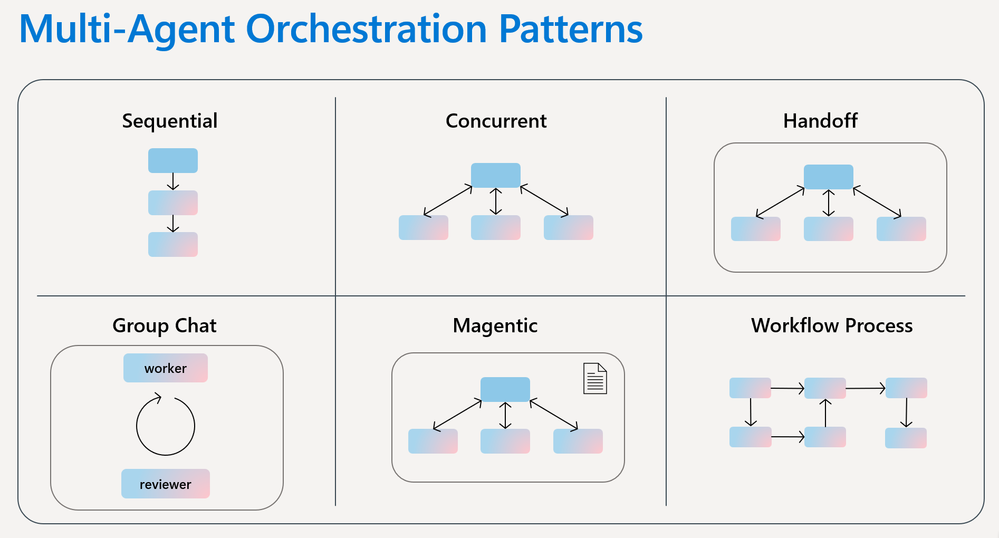

# 09. Multi-agent Orchestration

**Estimated time:** 25 minutes



> [!IMPORTANT]
> This module builds on [Module 02](../02-first-agent/README.md). You should be comfortable creating `AIAgent` instances before continuing.

<!-- markdownlint-disable-next-line MD028 -->
> [!TIP]
> Tick the checkbox next to each step as you complete it to track your progress through this module.

## Objectives

- Create specialist agents as discrete `AIAgent` instances.
- Register specialists as skills on the orchestrating concierge with `.WithAgentSkill()`.
- Observe the concierge routing to the correct specialist for each query.
- See the `[Agent →]` delegation lines in the terminal showing the routing decisions.

## Concepts

### Multi-agent orchestration

A single agent with broad instructions often produces inconsistent results. The **multi-agent pattern** solves this by splitting responsibility: an **orchestrator** focuses only on understanding the user's intent and routing, while **specialist agents** focus only on their specific domain.

This improves quality because each agent's instructions are shorter and more focused, and reduces the risk of one concern interfering with another.

### Orchestration patterns

The [Azure Architecture Center](https://learn.microsoft.com/en-us/azure/architecture/ai-ml/guide/ai-agent-design-patterns) defines five proven patterns for coordinating multiple agents. Each is optimised for a different type of coordination requirement.

| Pattern | Also known as | How it works | Best for |
|---|---|---|---|
| **Sequential** | Pipeline, prompt chaining | Agents run in a defined linear order; each receives the previous agent's output | Step-by-step workflows with clear stage dependencies |
| **Concurrent** | Parallel, fan-out/fan-in | Multiple agents process the same input simultaneously; results are aggregated | Independent analysis from multiple perspectives |
| **Group chat** | Roundtable, collaborative | Agents contribute to a shared conversation thread managed by a chat manager | Consensus-building, brainstorming, and maker-checker validation |
| **Handoff** | Routing, triage, dispatch | One agent at a time; each can assess a task and transfer control to a more appropriate agent | Tasks where the right specialist only emerges during processing |
| **Magentic** | Dynamic orchestration | A manager agent builds and refines a task ledger dynamically | Open-ended problems with no predetermined solution path |

This module demonstrates the **handoff** pattern: the Trip Disruption Concierge determines which domain a query belongs to and delegates to the appropriate specialist. The routing is non-deterministic — the model decides which specialist to invoke — and the concierge incorporates the specialist's result into its own final response.

> [!NOTE]
> Before adopting multi-agent orchestration, evaluate whether a single agent with well-configured tools would suffice. The Azure Architecture Center guidance recommends using the lowest level of complexity that reliably meets your requirements — each additional agent introduces coordination overhead, latency, and failure modes.

### Agents as function tools

The Agent Framework exposes a connected agent to an orchestrator by wrapping it as a callable tool with `.AsAIFunction()`. The orchestrator receives each specialist as an entry in its `tools:` collection — the same parameter used for regular C# function tools:

```csharp
var concierge = client.AsAIAgent(
    model: model,
    instructions: "...",
    tools:
    [
        rebookingSpecialist.AsAIFunction(),
        accommodationSpecialist.AsAIFunction(),
        compensationSpecialist.AsAIFunction(),
    ]);
```

When the model decides to delegate, the framework invokes the matching specialist and returns its response to the concierge.

> [!NOTE]
> `.AsAIFunction()` is available via the `Microsoft.Agents.AI` namespace, which is transitively available when you reference `Microsoft.Agents.AI.Foundry`.

### Implementation considerations

The [Azure Architecture Center guidance](https://learn.microsoft.com/en-us/azure/architecture/ai-ml/guide/ai-agent-design-patterns) highlights several factors that directly affect routing quality and system reliability in multi-agent systems.

**Accurate, distinct tool descriptions** — the concierge uses each specialist's description (passed to `.AsAIFunction()`) to decide where to route a query. Vague or overlapping descriptions cause misrouting. Name the domain explicitly and make each description different from the others.

**Instruction clarity** — each specialist must be told in its instructions that it covers exactly one domain and must not handle other topics. Without this, the model may try to answer everything itself rather than respecting boundaries.

**Context and state management** — every agent call adds its own reasoning and results to the context window. For this module's simple three-query flow, the default context passing is appropriate. For longer pipelines or many agents, plan for context compaction to stay within model limits and avoid quality degradation.

**Reliability** — surface errors rather than hiding them so that the orchestrator can respond appropriately. Validate agent output before passing it downstream. For production systems, add timeout and retry logic and consider circuit-breaker patterns for agent dependencies.

**Avoid unnecessary agents** — a common pitfall is adding agents that do not provide meaningful specialisation. If a single agent with three function tools can produce the same quality of responses, that is a simpler and faster solution. Add separate agents when specialisation genuinely improves quality, when security boundaries require it, or when agents are reused across multiple orchestrations.

## Steps

### Part 1 — Create the specialist agents

#### 1. Open the starter file

- [ ] Open `src/Program.cs` in the editor.

#### 2. Create the three specialist agents (TODO 1)

- [ ] Locate `// ── TODO 1` and replace the commented-out block with:

  ```csharp
  var rebookingSpecialist = client.AsAIAgent(
      model: model,
      instructions:
          "You are the Rebooking Specialist. Your only role is to find " +
          "alternative flight options for disrupted passengers. " +
          "Always list specific flight numbers, times, and seat availability. " +
          "Be direct and practical.");

  var accommodationSpecialist = client.AsAIAgent(
      model: model,
      instructions:
          "You are the Accommodation Specialist. Your only role is to help " +
          "stranded passengers find hotel accommodation near the airport. " +
          "Suggest two or three specific options with estimated cost.");

  var compensationSpecialist = client.AsAIAgent(
      model: model,
      instructions:
          "You are the Compensation Specialist. Your only role is to explain " +
          "and calculate passenger compensation entitlements under airline " +
          "disruption policies. Provide clear figures and next steps.");

  Console.ForegroundColor = ConsoleColor.DarkGray;
  Console.WriteLine("[Loop] Specialist agents created: rebooking, accommodation, compensation");
  Console.ResetColor();
  Console.WriteLine();
  ```

### Part 2 — Build the orchestrating concierge

#### 3. Create the concierge with agent skills (TODO 2)

- [ ] Locate `// ── TODO 2` and replace the commented-out block with:

  ```csharp
  var concierge = client
      .AsAIAgent(
          model: model,
          instructions:
              "You are the Trip Disruption Concierge. You coordinate with " +
              "specialist agents to help passengers. For flight rebooking, " +
              "always call RebookFlight. For hotel accommodation, call FindHotel. " +
              "For compensation questions, call CalculateCompensation. " +
              "Never answer these topics yourself — always delegate to the " +
              "appropriate specialist.")
      .WithAgentSkill(
          rebookingSpecialist,
          "RebookFlight",
          "Find alternative flight options for a disrupted passenger.")
      .WithAgentSkill(
          accommodationSpecialist,
          "FindHotel",
          "Find hotel accommodation options near the airport for a stranded passenger.")
      .WithAgentSkill(
          compensationSpecialist,
          "CalculateCompensation",
          "Explain and calculate the passenger's compensation entitlement.");

  Console.ForegroundColor = ConsoleColor.DarkGray;
  Console.WriteLine("[Loop] Concierge created with 3 specialist skills.");
  Console.ResetColor();
  Console.WriteLine();
  ```

#### 4. Run queries that exercise all three specialists (TODO 3)

- [ ] Locate `// ── TODO 3` and replace the commented-out block with the three queries already commented out there.

  > [!NOTE]
  > The third query should be phrased to require multiple specialists in a single turn. Watch for multiple `[Agent →]` delegation lines in the terminal output.

### Part 3 — Run and verify

#### 5. Run the starter

- [ ] In a terminal, run:

  ```bash
  dotnet run --project labs/agent-framework-dotnet/09-multi-agent/src/TripConcierge.MultiAgent.csproj
  ```

## Validation

- Each specialist agent logs its name when activated (yellow `[Specialist]` lines).
- The concierge routes each query to a different specialist.
- Query 3 triggers multiple specialists within a single turn.

## Congratulations 🎉

You built a multi-agent system where a concierge orchestrates three specialist agents. Each specialist stays focused on its domain while the concierge handles routing — producing more consistent, higher-quality responses than a single broad-purpose agent would.

> [!TIP]
> **Next up → [Module 10: Hosted Agents](../10-hosted-agents/README.md)**
> Package the Trip Disruption Concierge as an ASP.NET Core web service that exposes the standard Foundry Responses API endpoint.

## Troubleshooting

| Symptom | Fix |
|---|---|
| Concierge answers without calling specialists | Strengthen the routing instructions in the concierge system prompt using directive language (`NEVER`, `ALWAYS`) |
| `AuthenticationFailedException` | Run `az login` and confirm your account has the Foundry User role on the project |
| `NotImplementedException` | A TODO is still incomplete — check the starter code |
