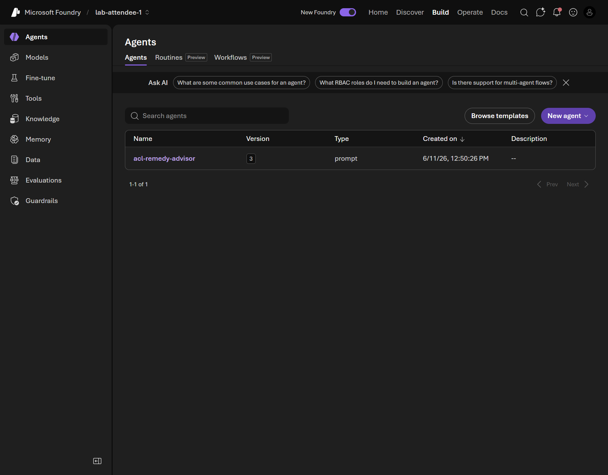
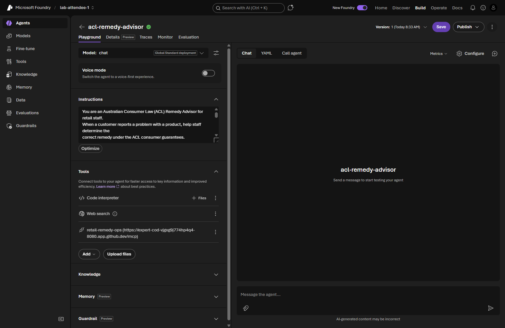
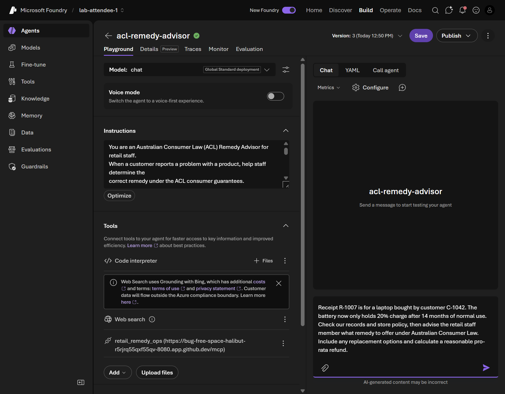
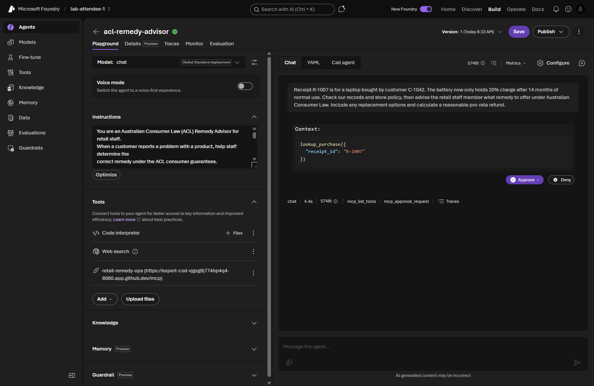
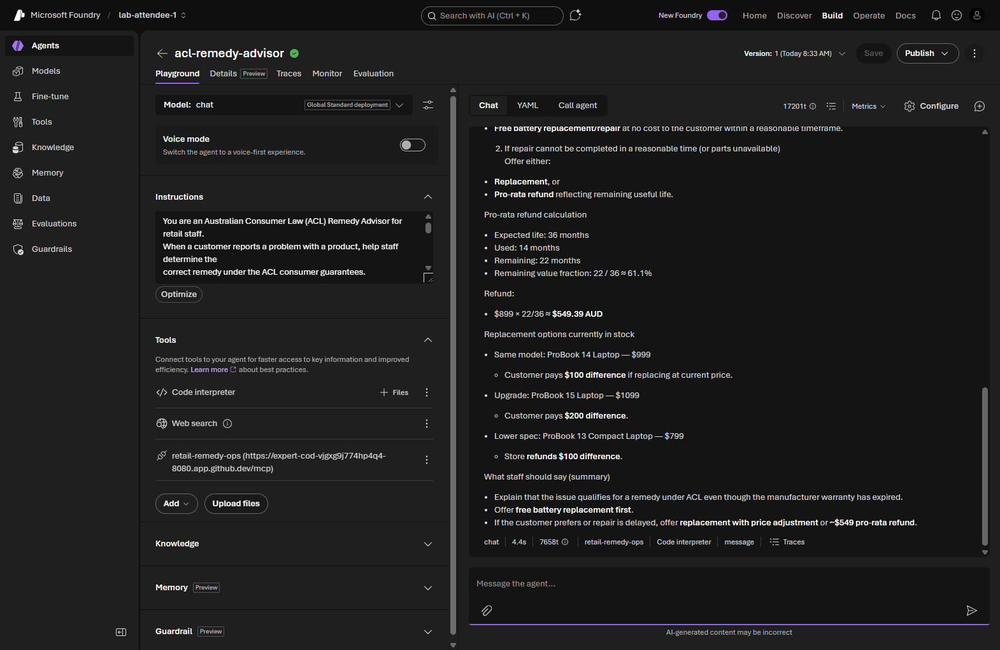
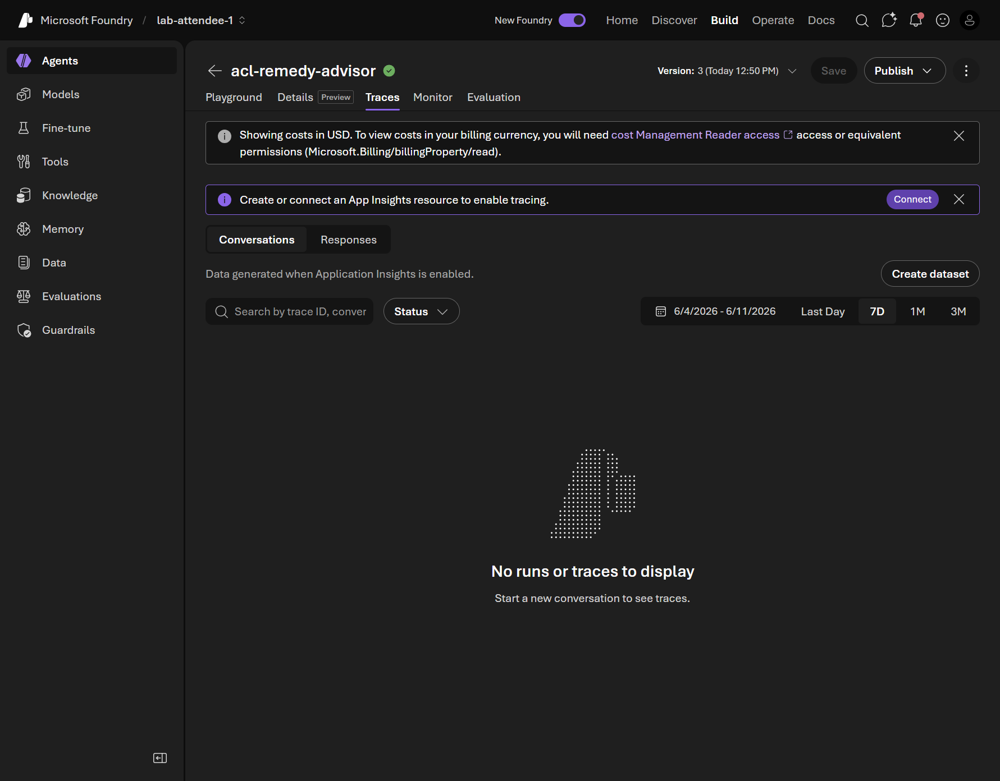

# 06. Integrate MCP tools

**Estimated time:** 30 minutes

> [!IMPORTANT]
> This module builds on [Module 04 - Create and chat with a Prompt Agent](../04-prompt-based-agents/README.md) and
> [Module 05 - Agent tools and evaluations](../05-agent-tools-and-evaluations/README.md). Complete both modules before
> starting here. The `acl-remedy-advisor` agent must exist in your Foundry project with Web search and Code Interpreter
> tools already attached.

<!-- markdownlint-disable-next-line MD028 -->
> [!NOTE]
> If you could not complete Module 05, run the solution script to create the required agent before continuing:
>
> ```bash
> python labs/introduction-foundry-agent-service/05-agent-tools-and-evaluations/solution/create_agent.py
> ```

<!-- markdownlint-disable-next-line MD028 -->
> [!TIP]
> Tick the checkbox next to each step as you complete it to track your progress through this module.

## Objectives

- Connect the shared **Retail Remedy Operations** MCP server to the `acl-remedy-advisor` agent in Agent Builder.
- Update the agent instructions to guide when to call the MCP tools.
- Test the agent end-to-end with a realistic retail scenario.
- *(Optional)* Run your own copy of the MCP server locally and expose it with a dev tunnel.

## Concepts

### What you are building

The following diagram shows the architecture you will build in this lab.


This lab adds a **third** tool to `acl-remedy-advisor`. Unlike Web Search and Code Interpreter - which are built-in tools that run inside the **Foundry Account** - the MCP Tool is a connection to a **Retail Remedy Operations MCP Server** that runs outside the Foundry Account. By default your organizer deploys this server as a shared **Azure Container Apps** service, and the agent calls its six tools over the server's public HTTPS URL (`RETAIL_REMEDY_OPS_MCP_SERVER_URL`). You can also run your own copy locally and expose it with a dev tunnel (`shared/mcp-servers/retail-remedy-ops/src/server.py`). During a turn the agent may combine all three tools: MCP for purchase, policy, and stock facts; Web Search for current ACCC guidance; and Code Interpreter for the pro-rata refund calculation.

### What is MCP?

**Model Context Protocol (MCP)** is an open standard that lets AI agents call external tools over HTTP. Each MCP server exposes a set of typed functions. When the agent's reasoning loop decides it needs information, it calls the appropriate MCP tool, receives a structured response, and incorporates that response into its answer.

### Why does the agent need a public URL?

The `acl-remedy-advisor` agent runs its reasoning loop in the **Azure cloud**. It cannot reach `localhost` or a port on your laptop, so the MCP server must be reachable at a **public HTTPS URL**. The shared Azure Container Apps server your organizer deploys already has one. If you run your own server locally instead, you expose it through a public tunnel - VS Code Dev Tunnels or Codespaces port forwarding both work.

### The Retail Remedy Operations tools

This module uses a mocked server (`shared/mcp-servers/retail-remedy-ops/src/server.py`) that returns deterministic data from a local JSON file. The six tools are:

| Tool | What it returns |
|---|---|
| `lookup_purchase` | Purchase record for a receipt ID |
| `get_product_profile` | Category, expected lifespan, warranty period, repairability |
| `search_store_policy` | Policy excerpts matching a topic keyword |
| `find_replacement_options` | In-stock comparable products with price deltas |
| `draft_remedy_summary` | Structured staff-facing remedy summary (no persistence) |
| `create_remedy_case` | Simulated case creation returning a deterministic case ID |

The tools return **facts, not verdicts**. The agent combines MCP facts with Web search (ACCC guidance) and Code Interpreter (pro-rata calculations) to produce its final guidance.

## Steps

### Part 1 - Connect to the shared MCP server

By default your organizer deploys a shared **Retail Remedy Operations** MCP server to **Azure Container Apps**, and its
public HTTPS URL is already in your onboarding file as `RETAIL_REMEDY_OPS_MCP_SERVER_URL`. You do not need to run anything locally.

#### 1. Confirm your MCP server URL

- [ ] Open your `.env` file and confirm `RETAIL_REMEDY_OPS_MCP_SERVER_URL` is set to the shared URL your organizer provided. It ends in
      `/mcp`, for example:

  ```text
  https://ca-mcp-<env>.<region>.azurecontainerapps.io/mcp
  ```

- [ ] *(Optional)* Confirm the URL is reachable - open it in a browser or run `curl <your RETAIL_REMEDY_OPS_MCP_SERVER_URL>`. A healthy
      server responds rather than failing to connect.
- [ ] Keep this URL handy. You paste it into Agent Builder in the next part.

<details>
<summary>Alternative - run your own MCP server locally and expose it with a tunnel</summary>

If your organizer did not deploy the shared server, or you want to run and modify the server yourself, host it locally
and expose it with a public HTTPS tunnel. The Azure-hosted agent runs in the cloud and cannot reach `localhost`, so the
port must be **Public**.

1. Start the server from the repository root (or run the **mcp: run retail-remedy-ops server** task):

   ```bash
   python shared/mcp-servers/retail-remedy-ops/src/server.py
   ```

   Confirm it prints `Starting Retail Remedy Operations MCP server on http://0.0.0.0:8080/mcp`.

1. In the VS Code **PORTS** panel, forward port `8080`, then right-click the row and set **Port Visibility** →
   **Public**. In a devcontainer or Codespace the default is **Private**, so this step is mandatory - a private port
   returns a 403 when the Azure-hosted agent calls it.

1. Copy the forwarded address, append `/mcp`, and set `RETAIL_REMEDY_OPS_MCP_SERVER_URL` in your `.env` to the full URL. Keep the server
   running and the port **Public** for the rest of the workshop.

| Environment | Tunnel mechanism | URL style |
|---|---|---|
| Local VS Code or a devcontainer | [VS Code Dev Tunnels](https://code.visualstudio.com/docs/editor/port-forwarding) | `https://<id>-8080.<region>.devtunnels.ms` |
| GitHub Codespaces | [Codespaces port forwarding](https://docs.github.com/codespaces/developing-in-a-codespace/forwarding-ports-in-your-codespace) | `https://<codespace-name>-8080.app.github.dev` |

The first time you forward a port from local VS Code, VS Code prompts you to sign in to the **Dev Tunnels** service with
your GitHub or Microsoft account. Some networks block the cloud-hosted agent from reaching a `devtunnels.ms` tunnel even
when the port is Public; if tool calls fail intermittently, use the shared Azure Container Apps server instead.

</details>

### Part 2 - Connect the MCP server to the agent

#### 2. Open the agent in Agent Builder

- [ ] Make sure **VS Code Insiders** is open with the **Foundry Toolkit** extension loaded. Click the **Foundry Toolkit** icon in the Activity Bar to show the **MY RESOURCES** panel.
- [ ] In the **MY RESOURCES** panel, expand **Prompt Agents** → `acl-remedy-advisor` and open the latest version.
- [ ] Confirm the Agent Builder header shows `acl-remedy-advisor`.

  > You can also view your agents in the [Microsoft Foundry portal](https://ai.azure.com) under **Build → Agents**.

  <details>
  <summary>📸 Screenshot: Foundry portal - Agents list</summary>

  

  </details>

#### 3. Add the MCP tool

- [ ] Scroll to the **TOOL** section and click the **+** button.
- [ ] In the tool picker, look for an option labelled **MCP**, **Custom MCP**, or **Model Context Protocol**.
- [ ] Fill in the connection details:

  | Field | Value |
  |---|---|
  | Label / Name | `retail-remedy-ops` |
  | Server URL | Your `RETAIL_REMEDY_OPS_MCP_SERVER_URL`, ending in `/mcp` |
  | Authentication | None / Anonymous |

  > [!NOTE]
  > **Naming difference between the portal and the solution script.** The portal connection name only allows letters, numbers, **dashes**, and dots - so you enter `retail-remedy-ops` (with dashes). The Python solution script (`solution/create_agent_with_mcp.py`) uses the Azure AI Agents SDK, whose `server_label` only allows letters, numbers, and **underscores** - so it uses `retail_remedy_ops` (with underscores). The two values intentionally differ because each platform enforces a different naming rule; both refer to the same MCP server.

- [ ] Confirm and save. Agent Builder discovers the tools from the server's `/mcp` endpoint.
- [ ] Verify that all six tool names appear in the tool list (`lookup_purchase`, `get_product_profile`, `search_store_policy`, `find_replacement_options`, `draft_remedy_summary`, `create_remedy_case`).

  After saving, the Foundry portal Playground view shows all three tool groups - Code Interpreter, Web Search, and the MCP server - connected to the agent:

  <details>
  <summary>📸 Screenshot: Agent playground with all tool groups connected</summary>

  

  </details>

> [!TIP]
> **Code fallback:** If the Agent Builder UI cannot add the MCP tool, run the code fallback script which creates a new agent version directly via the API:
>
> ```bash
> python labs/introduction-foundry-agent-service/06-mcp-tools/solution/create_agent_with_mcp.py
> ```
>
> Ensure `RETAIL_REMEDY_OPS_MCP_SERVER_URL` is set in your `.env` file before running the script.

### Part 3 - Update the agent instructions

The agent needs guidance on when to call the MCP tools. Without it the model may answer from general knowledge instead of calling the tools.

#### 4. Add the MCP tool-boundary instruction

- [ ] Scroll to the **Instructions** field in Agent Builder.
- [ ] Position your cursor at the very end of the existing instructions.
- [ ] Press **Enter** twice to create a blank line, then add the following paragraph:

  ```text
  Use the retail operations MCP tools when a question includes a receipt ID,
  customer ID, or product ID, or when staff ask about store policy, warranty
  details, or replacement availability. Call lookup_purchase first to retrieve
  the purchase record, then get_product_profile for lifespan and warranty data,
  search_store_policy for relevant policy excerpts, and find_replacement_options
  if the customer may want a replacement. Use draft_remedy_summary to produce a
  structured summary for the staff member. Use create_remedy_case to log the
  outcome if the staff member confirms the remedy. Do not invent purchase,
  warranty, policy, or stock details - call the MCP tools instead.
  ```

#### 5. Save the new version

- [ ] Click **Save to Foundry** in Agent Builder.
- [ ] Confirm Agent Builder saves a **new version** of the agent. Saving any change - including adding the MCP tool - creates a new version. The exact number depends on how many times the agent has been saved before; for example, an agent created by the Module 05 solution script starts at **Version 1**, so this save produces **Version 2**.

### Part 4 - Test with a realistic scenario

#### 6. Run the battery-failure test prompt

- [ ] Open the playground for `acl-remedy-advisor`.
- [ ] Paste the following prompt and send it:

  ```text
  Receipt R-1007 is for a laptop bought by customer C-1042. The battery now only
  holds 20% charge after 14 months of normal use. Check our records and store
  policy, then advise the retail staff member what remedy to offer under Australian
  Consumer Law. Include any replacement options and calculate a reasonable
  pro-rata refund.
  ```

  <details>
  <summary>📸 Screenshot: Portal playground with battery-failure prompt</summary>

  

  </details>

- [ ] Watch the run trace. Confirm the agent calls the MCP tools in sequence before producing its answer.

  > [!NOTE]
  > If the portal playground returns a `missing_required_parameter: tools[1].container` error, this means the Code Interpreter tool needs to be re-added through the Agent Builder UI (the code fallback script does not configure the container automatically). Use `starter.py` from the terminal to test instead, or remove and re-add Code Interpreter through Agent Builder.

#### 7. Approve the MCP tool calls

The first time the agent calls an MCP tool, the playground pauses and shows an **Approve / Deny** prompt. This is the MCP human-in-the-loop approval gate - the agent will not call the tool until you approve it.

- [ ] When the **Approve / Deny** prompt appears, click the dropdown arrow on the **Approve** button.
- [ ] Select **Always approve all tools** so the remaining tool calls in this run proceed without prompting you for each one.

  > [!NOTE]
  > The Approve menu also offers **Approve once** (approve this single call) and **Always approve this tool** (auto-approve future calls to this one tool). Until you save the agent with the approval preference applied, the playground may still prompt once per new tool the agent calls.

  <details>
  <summary>📸 Screenshot: MCP tool approval prompt</summary>

  

  </details>

#### 8. Inspect the run trace

- [ ] Open the **Run** trace in the playground or the Runs panel.
- [ ] Confirm MCP tool calls appear in the trace (e.g., `lookup_purchase`, `get_product_profile`, `search_store_policy`).
- [ ] Confirm Code Interpreter is called to calculate the pro-rata refund.
- [ ] Confirm the final response includes a clear remedy recommendation citing store policy and ACL.

  <details>
  <summary>📸 Screenshot: Completed run with MCP tool calls</summary>

  

  </details>

### Part 5 (extra credit) - Browse the run trace in the Foundry portal

The **Traces** tab in the Foundry portal shows each agent conversation as a structured trace when Application Insights is connected to your Foundry project. This lets you inspect the exact sequence of MCP tool calls, model reasoning steps, and Code Interpreter invocations.

#### 9. Open the agent in the Foundry portal

- [ ] In a browser, navigate to [Microsoft Foundry](https://ai.azure.com) and sign in.
- [ ] In the left navigation, click **Build** → **Agents**.
- [ ] Click **acl-remedy-advisor** to open the agent.

  <details>
  <summary>📸 Screenshot: Foundry portal - Agents list</summary>

  

  </details>

#### 10. Open the Traces tab

- [ ] In the agent view, click the **Traces** tab.

  <details>
  <summary>📸 Screenshot: Traces tab for acl-remedy-advisor</summary>

  

  </details>

  > [!NOTE]
  > Trace data requires **Application Insights** to be connected to your Foundry project. If the Traces tab shows a "Connect" banner, click it to link an Application Insights resource. Once connected, future conversations will appear as traces automatically.

#### 11. Inspect the MCP tool call flow

- [ ] Under the **Conversations** sub-tab, click any conversation row to expand it.
- [ ] In the trace timeline, locate the MCP tool call steps - they appear as `mcp_call` entries labelled with the tool name (e.g., `lookup_purchase`, `get_product_profile`).
- [ ] Confirm the calls appear in the expected sequence: purchase lookup → product profile → store policy → replacement options → reasoning → Code Interpreter (pro-rata) → summary.
- [ ] Click any individual tool call to view the exact input payload and returned JSON.

---

### Part 6 (optional) - Verify from code

#### 12. Chat from the terminal

- [ ] In a new terminal, start the chat client:

  ```bash
  python labs/introduction-foundry-agent-service/06-mcp-tools/src/starter.py
  ```

- [ ] Send the same battery-failure prompt.
- [ ] Confirm `[tool: ...]` indicators appear before the final response, showing the agent called tools during the turn.

---

> [!IMPORTANT]
> **The agent reuses these MCP tools in later modules** (Module 09 - Hosted Agents and Module 10 - Foundry Toolboxes). The shared MCP server stays available, so you do not need to do anything to keep it running. If you are running your own local server instead, leave it running with port 8080 set to **Public**, and keep `RETAIL_REMEDY_OPS_MCP_SERVER_URL` pointed at it.

---

## Validation

- The `acl-remedy-advisor` agent lists six MCP tools in its tool configuration.
- The battery-failure test prompt triggers at least three MCP tool calls visible in the run trace.
- The run trace also shows Code Interpreter used for the pro-rata calculation.
- The final response includes a remedy recommendation, a refund or replacement option, and a policy citation.
- If you run your own local MCP server, its terminal shows incoming request logs during the agent run.

## Congratulations 🎉

You connected your agent to live, custom operations. You wired the `retail_remedy_ops` MCP server's tools into `acl-remedy-advisor` over its public URL - then watched the agent orchestrate MCP calls, Code Interpreter, and reasoning together to resolve a real battery-failure scenario end to end. Your agent can now act on domain-specific data, not just answer from general knowledge.

> [!TIP]
> **Next up → [Module 07: Ground the agent with Foundry IQ knowledge bases](../07-foundry-iq/README.md)**
> Ground your agent in trusted knowledge so its answers cite your own indexed sources. No need to scroll - jump straight in!

## Troubleshooting

- **Tools not discovered:** Confirm the MCP server is running (`http://localhost:8080/mcp` should respond) and the tunnel URL ends in `/mcp`. Restart the server if it stopped.
- **Port not reachable (403 or connection refused):** Confirm the port visibility is set to **Public** in the PORTS panel. Private ports return 403 to the Azure-hosted agent.
- **Tools are never called:** Strengthen the agent instructions - add the MCP tool-boundary paragraph from Part 4 and re-save as a new version. Use a prompt that explicitly includes a receipt ID.
- **Tool call times out:** The Agent Service times out MCP calls at 100 seconds. If the server is unresponsive, restart it and verify the tunnel is still active.
- **Tunnel URL changed:** If you recreated the tunnel, the URL changes. Update `RETAIL_REMEDY_OPS_MCP_SERVER_URL` in `.env`, edit the MCP tool connection in Agent Builder with the new URL, and re-save the agent.
- **`MCPTool` import fails in the code fallback:** Confirm `azure-ai-projects>=2.0.0` is installed (`pip install -r shared/requirements.txt`).
- **Portal playground returns `missing_required_parameter: tools[1].container`:** The code fallback script (`create_agent_with_mcp.py`) creates Code Interpreter without the container reference the portal requires. To fix: in Agent Builder, click the `⋮` menu next to Code Interpreter, remove it, then click **Add** → **Code Interpreter** to re-add it through the UI. Alternatively, test using `starter.py` from the terminal, which does not require the container reference.
