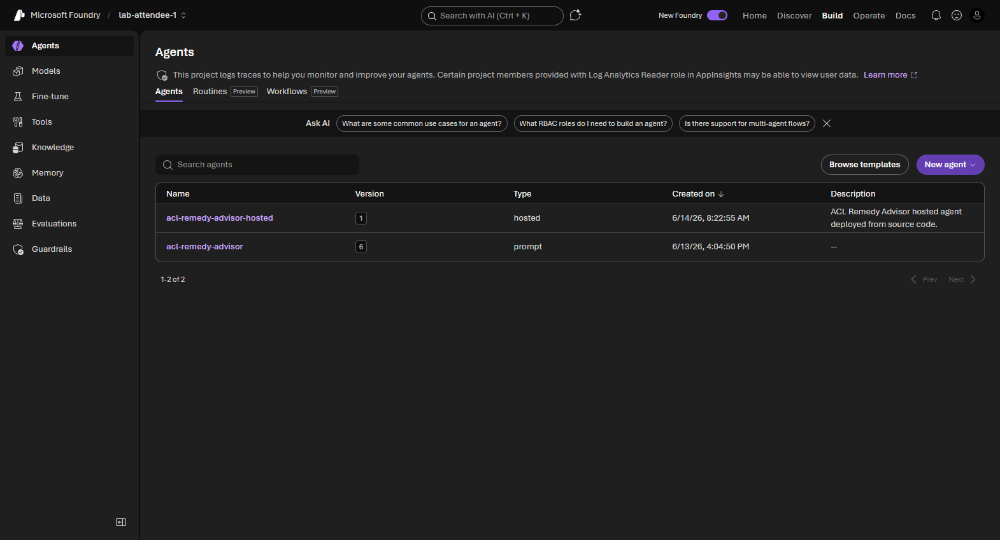
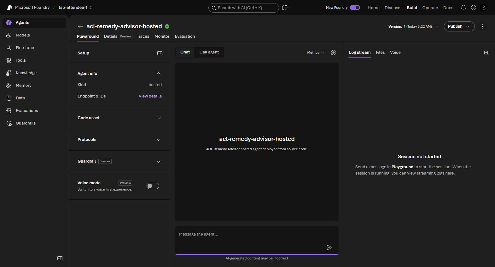
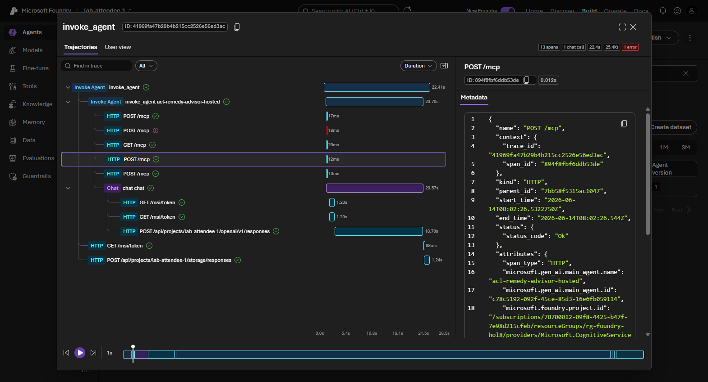
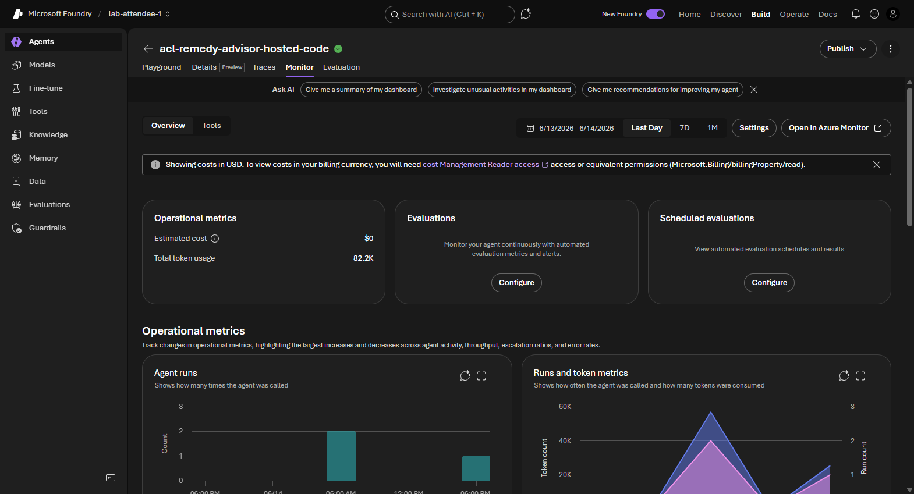

# 09. Build and run a hosted agent

**Estimated time:** 35 minutes


> [!IMPORTANT]
> This module builds on two earlier modules:
>
> - [Module 06 - Integrate MCP tools](../06-mcp-tools/README.md): the `retail_remedy_ops` MCP server must be running and publicly exposed on port 8080. The hosted agent calls it over `RETAIL_REMEDY_OPS_MCP_SERVER_URL` at runtime.
> - [Module 08 - Use Agent Framework for Python](../08-agent-framework-python/README.md): you package a **code-first Agent Framework agent** and deploy it as a **hosted agent** that runs fully managed inside your Foundry project.

<!-- -->

> [!NOTE]
> Hosted agents are a **preview** feature of Microsoft Foundry Agent Service. The Python SDK calls in this module pass `allow_preview=True` to `AIProjectClient`.

<!-- -->

> [!TIP]
> Tick the checkbox next to each step as you complete it to track your progress through this module.

## Objectives

- Understand what a hosted agent is and how it differs from the Prompt Agents you built in Modules 04-07.
- Package a code-first Agent Framework agent that serves the **Responses** protocol.
- Deploy the agent from **source code** (Part 2) as a fully managed hosted agent. _Part 1 (container-image deploy) is skipped in the current preview - see the note in Part 1._
- Understand the hosted agent's Microsoft Entra identity and its implicit project access.
- Invoke the deployed hosted agent from Python and hold a multi-turn conversation.

## Concepts

### What a hosted agent is

A **Prompt Agent** (Modules 04-07) is configured _declaratively_ on the Foundry
service - you give it a model, instructions, and tools, and Foundry runs it. A
**hosted agent** is different: _you_ write the agent as a container that Foundry
hosts and scales for you. The agent's logic, tools, and dependencies all live in
your code, while Foundry provides a managed endpoint, autoscaling, observability,
and a dedicated identity.

Use a hosted agent when you need full control of the agent's orchestration - custom
tools, your own libraries, or logic that does not fit the declarative Prompt Agent
model - but still want a fully managed, serverless endpoint.


### The Responses protocol and ResponsesHostServer

A hosted agent communicates over the OpenAI-compatible **Responses** protocol on
port **8088**. You do not implement that server by hand. The Agent Framework's
`ResponsesHostServer` wraps your `Agent` and serves the protocol for you:

```python
from agent_framework_foundry_hosting import ResponsesHostServer

ResponsesHostServer(agent).run()
```

The agent bundle for this module lives in [`src/agent/`](https://github.com/PlagueHO/foundry-agentic-workshop/tree/main/labs/introduction-foundry-agent-service/09-hosted-agents/src/agent):

| File | Purpose |
|------|---------|
| `main.py` | Builds the ACL Remedy Advisor agent (wired to the live Module 06 MCP server) and serves it with `ResponsesHostServer`. |
| `requirements.txt`, `Dockerfile`, `agent.yaml`, `.dockerignore` | Packaging for the hosted agent. |

The hosted agent exposes the live `retail_remedy_ops` **MCP server** (the same public
endpoint from Module 06) plus the Foundry hosted **web search** tool. It does _not_ call the
Module 07 Foundry IQ knowledge base - a hosted agent runs as its own Microsoft Entra
identity, which cannot be granted data-plane access to the RBAC-only Azure AI Search service
currently.

Because the MCP server is anonymous, the hosted agent needs no extra permissions to reach
it; it only needs outbound network access to the public tunnel URL. The dev-tunnel URL is
baked into the deploy as the `RETAIL_REMEDY_OPS_MCP_SERVER_URL` environment variable, so if
the tunnel changes you must **redeploy** the agent.

### Two ways to deploy

Each part deploys a **separate** hosted agent from the _same_ `src/agent/` bundle.
**Part 2 (source code) is the path you run in this workshop**; Part 1 (container image)
is documented so you understand what happens under the hood, but it is **skipped in the
current preview** (see the note in Part 1):

- **Part 1 - from a container image** → `acl-remedy-advisor-hosted-container`. You build
  the image with Docker, push it to the shared workshop **Azure Container Registry
  (ACR)**, and point Foundry at the image. This shows exactly what is happening under
  the hood. **This path is skipped in the current preview** - see the note in
  [Part 1](#part-1---deploy-from-a-container-image-skip-for-now).
- **Part 2 - from source code (preview)** → `acl-remedy-advisor-hosted-code`. You hand
  Foundry a zip of `src/agent/` and it builds the image _remotely_ - no local Docker
  required. This is the recommended path for this workshop.

> [!NOTE]
> A single hosted agent can also accrue **multiple versions** - for example, deploying
> the container image and then the source code under one name builds a version history
> you can roll between. This module keeps them as two distinct agents so you can compare
> the deployment methods directly.

### The agent's own identity

Every hosted agent gets its **own Microsoft Entra agent identity** when you deploy
it. That identity - not yours - calls models and tools at runtime. Foundry gives the
identity implicit access to model inference and session storage within its own project,
so the standard hosted-agent flow needs no explicit role assignment. Assign roles only
when the agent accesses external resources such as Azure Storage, Azure AI Search, or
Azure Container Registry.

### Avoiding collisions in a shared workshop

All attendees share one Azure Container Registry. Part 1 tags the image with your
**project name** (`acl-remedy-advisor-hosted-container:<project>`), and every hosted
agent is scoped to your own project, so attendees never overwrite each other.

## Steps

### Prepare

- [ ] Confirm the shared dependencies are installed:

   ```bash
   uv sync
   ```

- [ ] Sign in with the Azure CLI so `DefaultAzureCredential` can authenticate, and load your environment values:

   ```bash
   az login
   azd env get-values
   ```

   > [!NOTE]
   > Confirm your `.env` file sets `FOUNDRY_PROJECT_ENDPOINT`, `AZURE_SUBSCRIPTION_ID`, `AZURE_RESOURCE_GROUP`, `FOUNDRY_RESOURCE_NAME`, `AZURE_CONTAINER_REGISTRY_NAME`, `AZURE_CONTAINER_REGISTRY_ENDPOINT`, and `RETAIL_REMEDY_OPS_MCP_SERVER_URL` (the public URL of your Module 06 MCP server, ending in `/mcp`). `HOSTED_AGENT_NAME_CONTAINER` defaults to `acl-remedy-advisor-hosted-container`, `HOSTED_AGENT_NAME_CODE` defaults to `acl-remedy-advisor-hosted-code`, `AGENT_MODEL` defaults to `chat`, and `RETAIL_REMEDY_OPS_MCP_SERVER_LABEL` defaults to `retail_remedy_ops`.

- [ ] Confirm the Retail Remedy Operations **MCP server from Module 06 is still running and publicly exposed** on port 8080, and that `RETAIL_REMEDY_OPS_MCP_SERVER_URL` is set to its public URL ending in `/mcp`. The hosted agent calls this server at runtime, so it must stay reachable while you deploy and invoke the agent. If it is not running, restart it and re-expose the port as described in [Module 06](../06-mcp-tools/README.md), Part 2:

   ```bash
   uv run python shared/mcp-servers/retail-remedy-ops/src/server.py
   ```

- [ ] Review the agent bundle in `src/agent/` - open `main.py` to see the tools the hosted agent exposes: the live `retail_remedy_ops` **MCP server** (over `RETAIL_REMEDY_OPS_MCP_SERVER_URL`) plus the Foundry hosted **web search** tool.

### Part 1 - deploy from a container image (skip for now)

> [!IMPORTANT]
> **Skip Part 1 and go straight to Part 2 (below).** Deploying a hosted agent from a container image currently requires the agent's **Entra Agent ID Blueprint** - the identity Foundry assigns to the agent when it is created - to hold the **Container Registry Repository Reader** role on the shared Azure Container Registry so it can pull the image. In this preview, **workshop attendees do not have permission to assign that role**, so the container pull fails.
>
> Earlier (legacy) hosted agents worked because they pulled the image using the **Foundry project's** managed identity, which is already granted **Container Registry Repository Reader** during provisioning. New hosted agents pull as their **own per-agent identity** instead, which does not yet have that role.
>
> A future version of this workshop will **pre-create the Entra Agent ID Blueprint with Container Registry Repository Reader** during provisioning, so that any agent created from it can pull container images. Until then, use the source-code path in **Part 2**, which builds and runs the image for you without a manual image pull.

<!-- markdownlint-disable-next-line MD028 -->
> [!NOTE]
> The container deploy script ([`solution/deploy_hosted_agent_container.py`](https://github.com/PlagueHO/foundry-agentic-workshop/blob/main/labs/introduction-foundry-agent-service/09-hosted-agents/solution/deploy_hosted_agent_container.py)) remains in the repository for reference and for facilitators, but it is **not expected to succeed for attendees** in the current lab. This is being tracked in GitHub issue [#9](https://github.com/PlagueHO/foundry-agentic-workshop/issues/9).

### Part 2 - deploy from source code (preview, recommended)

You complete [`src/starter.py`](https://github.com/PlagueHO/foundry-agentic-workshop/blob/main/labs/introduction-foundry-agent-service/09-hosted-agents/src/starter.py) to deploy the `src/agent/` bundle as a hosted agent. The starter already zips the bundle into `zip_bytes` / `zip_sha256`, opens an `AIProjectClient`, reads `RETAIL_REMEDY_OPS_MCP_SERVER_URL` / `RETAIL_REMEDY_OPS_MCP_SERVER_LABEL`, and imports the shared `wait_for_agent_version_active` helper - you fill in **three TODOs** inside the `with AIProjectClient(...) as client:` block. The code for each is below so you can complete the lab without leaving this page; the full reference is in [`solution/deploy_hosted_agent_code.py`](https://github.com/PlagueHO/foundry-agentic-workshop/blob/main/labs/introduction-foundry-agent-service/09-hosted-agents/solution/deploy_hosted_agent_code.py).

- [ ] **TODO 1 - prepare the code stream and describe the hosted agent.** Wrap `zip_bytes` in an `io.BytesIO` stream and build a `HostedAgentDefinition` that tells Foundry how to build and run the image - 1 vCPU, 2 GiB of memory, a remote Python 3.13 build, and the **Responses** protocol:

   ```python
   code_stream = io.BytesIO(zip_bytes)
   code_stream.name = f'{agent_name}.zip'
   definition = HostedAgentDefinition(
       cpu=CPU,
       memory=MEMORY,
       environment_variables={
           'AZURE_AI_MODEL_DEPLOYMENT_NAME': model_deployment,
           'RETAIL_REMEDY_OPS_MCP_SERVER_URL': mcp_server_url,
           'RETAIL_REMEDY_OPS_MCP_SERVER_LABEL': mcp_server_label,
       },
       code_configuration=CodeConfiguration(
           runtime=RUNTIME,
           entry_point=['python', 'main.py'],
           dependency_resolution=CodeDependencyResolution.REMOTE_BUILD,
       ),
       protocol_versions=[ProtocolVersionRecord(protocol='responses', version='2.0.0')],
   )
   ```

- [ ] **TODO 2 - create the version from code.** Upload the bundle and create the agent version. Foundry validates the zip hash and starts building the image remotely:

   ```python
   created = client.agents.create_version_from_code(
       agent_name=agent_name,
       definition=definition,
       code=code_stream,
       code_zip_sha256=zip_sha256,
       description='ACL Remedy Advisor hosted agent deployed from source code.',
   )
   print(f'Created hosted agent {agent_name} version {created.version}; Foundry is building it.')
   ```

- [ ] **TODO 3 - wait for active.** Poll until the new version reports `active`. The helper is already imported at the top of the starter from [`solution/hosted_agent_support.py`](https://github.com/PlagueHO/foundry-agentic-workshop/blob/main/labs/introduction-foundry-agent-service/09-hosted-agents/solution/hosted_agent_support.py):

   ```python
   wait_for_agent_version_active(client, agent_name, created.version)
   ```

   Remove the `raise NotImplementedError(...)` line once all three TODOs are complete.

- [ ] Run your completed starter to deploy the agent from source code. Foundry zips `src/agent/`, builds the image remotely, and runs it as a hosted agent:

   ```bash
   uv run python labs/introduction-foundry-agent-service/09-hosted-agents/src/starter.py
   ```

   > [!TIP]
   > If you get stuck, run the reference implementation instead:
   >
   > ```bash
   > uv run python labs/introduction-foundry-agent-service/09-hosted-agents/solution/deploy_hosted_agent_code.py
   > ```

- [ ] Wait until the script reports `Agent version is now active.` - your hosted agent `acl-remedy-advisor-hosted-code` is now live in your project.

### Invoke the hosted agent

- [ ] Chat with the source-code hosted agent (`acl-remedy-advisor-hosted-code`). The script selects its latest active version, opens a session, and runs a two-turn conversation over the Responses API:

   ```bash
   uv run python labs/introduction-foundry-agent-service/09-hosted-agents/solution/invoke_hosted_agent.py
   ```

- [ ] Confirm the second turn (the follow-up about the original box and charger) builds on the answer from the first turn.
- [ ] In the Foundry portal, open **Agents** and confirm `acl-remedy-advisor-hosted-code` appears with an active version. If you also ran Part 1, `acl-remedy-advisor-hosted-container` appears alongside it.

  <details>
  <summary>📸 Screenshot: Agents list with the hosted agents</summary>

  

  </details>

- [ ] Click `acl-remedy-advisor-hosted-code` to open its detail page and confirm the **Agent info** panel shows **Kind: hosted** with the active version selected.

  <details>
  <summary>📸 Screenshot: Hosted agent detail page</summary>

  

  </details>

- [ ] Open the **Traces** tab and confirm the invocation from the previous step appears as a completed trace with MCP tool calls visible in the span tree. Then switch to the **Monitor** tab and confirm the agent run count and token usage reflect the invoke run.

  <details>
  <summary>📸 Screenshot: Hosted agent traces</summary>

  

  </details>

  <details>
  <summary>📸 Screenshot: Hosted agent monitor</summary>

  

  </details>

## Validation

- The deploy reports `Agent version is now active.` once the new version finishes building (`acl-remedy-advisor-hosted-code` for Part 2, `acl-remedy-advisor-hosted-container` for Part 1).
- `invoke_hosted_agent.py` prints a grounded remedy answer for the first prompt and a context-aware answer for the follow-up.
- `acl-remedy-advisor-hosted-code` (and `acl-remedy-advisor-hosted-container` if you ran Part 1) appears in the **Agents** list in the Foundry portal with an active version.
- The hosted agent calls its `retail_remedy_ops` MCP tools (for example, looking up receipt `R-1007`) rather than answering generically.

## Congratulations 🎉

You shipped a code-first agent. You wired the live `retail_remedy_ops` MCP server and hosted
**web search** into a hosted agent, deployed it from source code, and held a multi-turn
conversation with the managed endpoint. This is the pattern for production workloads that
need custom orchestration with a fully managed, serverless runtime.

> [!TIP]
> **Next up → [Module 10: Foundry Toolboxes](../10-foundry-toolboxes/README.md)**
> Bundle your tools into a reusable Toolbox and consume it from any agent framework. No need to scroll - jump straight in!

## Troubleshooting

- **Authentication fails** - the scripts use `DefaultAzureCredential`, which relies on your Azure CLI session. Run `az login` in the terminal to re-authenticate, then retry.
- **The agent identity cannot call the model (403 at runtime)** - confirm the agent calls the model through `FOUNDRY_PROJECT_ENDPOINT`. Project-local model inference is implicit; direct calls to an account-level endpoint require an explicit role assignment.
- **The hosted agent cannot reach the MCP server / retail tools fail at runtime** - the agent calls the public `RETAIL_REMEDY_OPS_MCP_SERVER_URL` from inside Foundry's managed compute. Confirm the Module 06 MCP server is still running and the dev tunnel is **publicly** exposed, and that `RETAIL_REMEDY_OPS_MCP_SERVER_URL` (ending in `/mcp`) was set **before** you deployed - the URL is baked into the agent at deploy time, so if the tunnel changed you must **redeploy**. If the server is reachable from your laptop but the agent still cannot call it, the hosted runtime may be blocking outbound egress to the tunnel; report it to your facilitator.
- **`docker: command not found` (Part 1)** - Docker is not available in your environment. Use Part 2 (source-code deploy) instead.
- **The version never becomes active** - open the agent in the Foundry portal and check the version's build logs. A failed remote build usually means a dependency in `src/agent/requirements.txt` could not be installed.
- **`acl-remedy-advisor-hosted-code` is not found when invoking** - confirm Part 2 completed successfully and that `HOSTED_AGENT_NAME_CODE` matches in your `.env`. (For the container agent, check `HOSTED_AGENT_NAME_CONTAINER`.)
