# 11. Agent operations and Agent ID

**Estimated time:** 30 minutes

> [!TIP]
> Tick the checkbox next to each step as you complete it to track your progress through this module.

## Objectives

- Locate the **Entra agent identity** and **Entra agent blueprint** for an agent, and understand what they are used for.
- Inspect per-agent operations on the **Traces** and **Monitor** tabs for both the `acl-remedy-advisor` prompt agent and your hosted agents `acl-remedy-advisor-hosted-*`.
- Understand why **continuous evaluation** and **red team** scans matter, and where they are configured.
- Use the **Operate** control plane to monitor agents across your project.
- Open the **Agents** view in Application Insights to see agent telemetry in Azure Monitor.
- *(Extra credit)* Configure continuous evaluation, scheduled evaluations, and scheduled red teaming from the **Monitor** settings.

## Key concepts

### Agent identity and the agent identity blueprint

An **agent identity** is a specialized identity type in [Microsoft Entra ID](https://learn.microsoft.com/entra/fundamentals/what-is-entra) designed specifically for AI agents. It is a special [service principal](https://learn.microsoft.com/entra/identity-platform/app-objects-and-service-principals) that represents the agent at runtime, with stable identifiers (object ID and app ID) that you can use for authentication and authorization decisions. Agent identities have no credentials of their own.

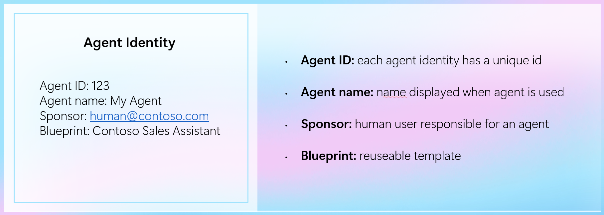

An [**agent identity blueprint**](https://learn.microsoft.com/entra/agent-id/agent-blueprint) is the Entra ID object that governs a class of agent identities and holds the OAuth credentials ([federated identity credentials](https://learn.microsoft.com/entra/workload-id/workload-identity-federation), certificates, or client secrets) used for lifecycle operations and runtime token exchange.

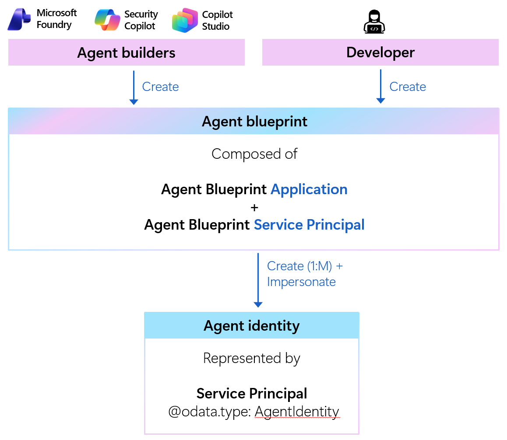

Foundry provisions and manages these for you automatically:

| Stage | Identity behavior |
|---|---|
| In the project (in development) | Each agent surfaces its **own named agent identity and blueprint** in the portal (for example, `acl-remedy-advisor-AgentIdentity`), which Foundry provisions automatically as you build and test. |
| Published or hosted | A published or hosted agent keeps a **distinct agent identity blueprint and agent identity** tied to its own agent application resource, giving it stronger isolation and granular, independently grantable access control. |

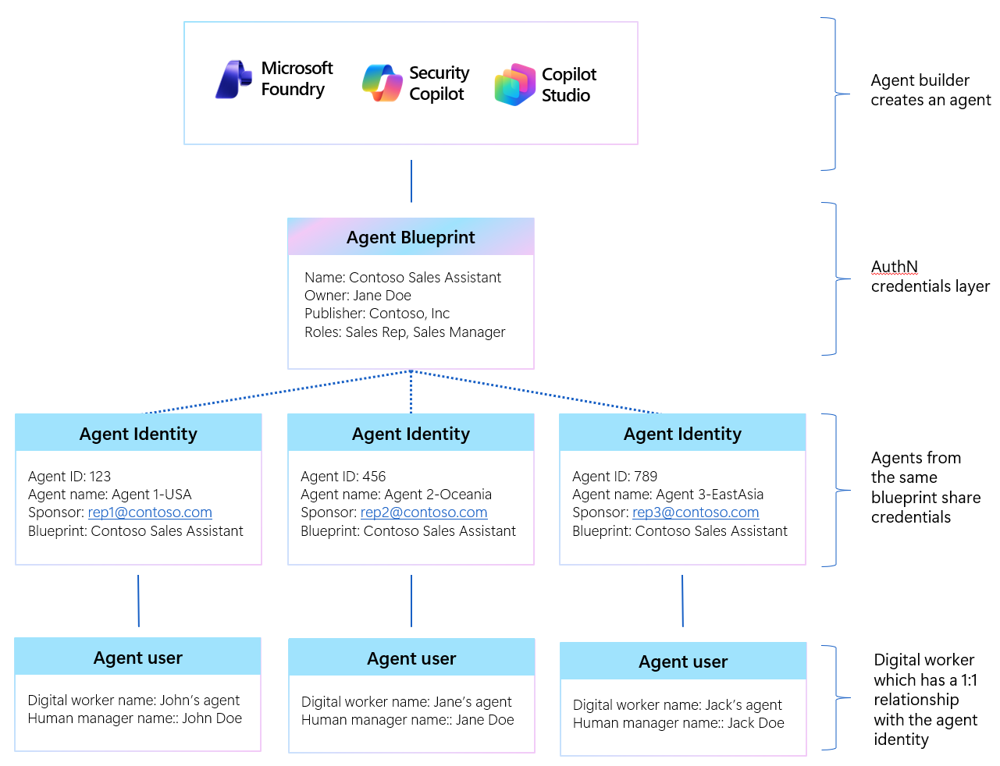

Agent identities serve two related needs:

1. **Management and governance** — give administrators a consistent way to inventory agents, apply [Conditional Access](https://learn.microsoft.com/entra/identity/conditional-access/overview) and [Identity Protection](https://learn.microsoft.com/entra/id-protection/overview-identity-protection) policies, and audit activity in the [Microsoft Entra admin center](https://entra.microsoft.com).
1. **Tool authentication** — let an agent authenticate to downstream systems (Azure Storage, MCP servers, Agent-to-Agent endpoints) through an automatic [OAuth 2.0 token exchange](https://learn.microsoft.com/entra/identity-platform/v2-oauth2-on-behalf-of-flow), without embedding secrets in prompts, code, or connection strings. This works in both *attended* (on-behalf-of a user) and *unattended* (application-only) flows.

> [!NOTE]
> Learn more in [Agent identity concepts in Microsoft Foundry](https://learn.microsoft.com/azure/ai-foundry/agents/concepts/agent-identity), [Agent identity blueprints](https://learn.microsoft.com/entra/agent-id/agent-blueprint), [Microsoft Entra Agent ID overview](https://learn.microsoft.com/entra/agent-id/overview), and [Governing agent identities](https://learn.microsoft.com/entra/id-governance/agent-id-governance-overview).

### Agent observability

Foundry gives you three lenses on a running agent:

1. **Traces** — the execution path of each conversation and response (model calls, tool calls, durations, tokens, cost). Trace data flows to the [Application Insights](https://learn.microsoft.com/azure/azure-monitor/app/app-insights-overview) resource connected to your project.
1. **Monitor** — a dashboard of operational metrics (agent runs, token usage, tool calls, and error rate) plus evaluation and red-team scores over a time range.
1. **Evaluation** — runs [evaluators](https://learn.microsoft.com/azure/ai-foundry/concepts/evaluation-evaluators-metrics) against datasets or sampled traffic to measure quality, safety, and task adherence.

> [!NOTE]
> This module is a guided tour. It reuses the `acl-remedy-advisor` agent from earlier modules and your hosted agent from [Module 09](../09-hosted-agents/README.md). Telemetry requires the project's Application Insights connection (provisioned by the workshop infrastructure) and at least one prior agent run.

## Steps

### Part 1 — Find the agent identity on the Details tab

- [ ] In [Microsoft Foundry](https://ai.azure.com), confirm the **New Foundry** toggle is on.
- [ ] Select **Build** in the top navigation, then open the `acl-remedy-advisor` agent.
- [ ] Select the **Details** tab (marked **Preview**).
- [ ] In the **Identity & access** section, locate the **Entra agent identity** for the agent. Foundry provisions a named identity automatically — for `acl-remedy-advisor` it is named `acl-remedy-advisor-AgentIdentity`. Note its **ID** (a GUID); you compare it to the hosted agent's identity in Part 4.
- [ ] Note the associated **Entra agent blueprint** (the [agent identity blueprint](https://learn.microsoft.com/entra/agent-id/agent-blueprint)). The blueprint is what Foundry authenticates as during the runtime token exchange when the agent calls a tool.
- [ ] Discuss what the identity is used for: governance (inventory, policy, audit) and secret-free tool authentication to downstream services.

  

  
📸 Screenshot: Entra agent identity and blueprint on the Details tab

  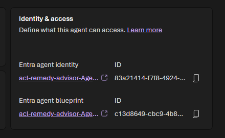

  

  > [!TIP]
  > To browse every agent identity in your tenant, go to the [Microsoft Entra admin center](https://entra.microsoft.com) → **Entra ID → Agent ID → All agent identities**. To see the project's default identity values, open the Foundry **project** in the [Azure portal](https://portal.azure.com), select **Overview → JSON View**, and read the `agentIdentity` and `agentIdentityBlueprint` fields.

### Part 2 — Per-agent operations: Traces (Conversations)

- [ ] With `acl-remedy-advisor` still open, select the **Traces** tab.
- [ ] Switch between the **Conversations** and **Responses** sub-tabs:
  - [ ] **Conversations** groups activity by conversation.
  - [ ] **Responses** lists individual model responses.
- [ ] Review the columns: **Conversation ID**, **Trace ID**, **Response ID**, **Status**, **Created at**, **Duration (s)**, **Tokens (In)**, **Tokens (Out)**, **Estimated cost ($)**, **Evaluation**, and **Agent version**.
- [ ] Use the date-range selector (**Last Day**, **7D**, **1M**, **3M**) to scope the view, then select a **Trace ID** to drill into the execution path for that run (model and tool spans, timings, and inputs/outputs).

  

  
📸 Screenshot: Traces → Conversations grid

  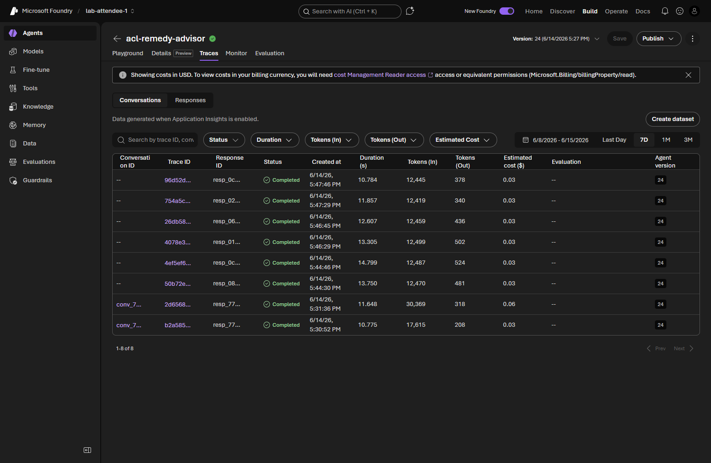

  

  

  
📸 Screenshot: Trace drill-down execution path

  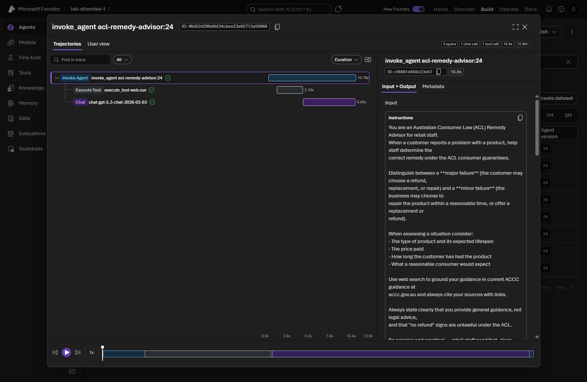

  

  > [!NOTE]
  > The Traces grid is populated *"Data generated when Application Insights is enabled."* If the grid is empty, run the agent once from an earlier module and refresh. See [Agent tracing overview](https://learn.microsoft.com/azure/ai-foundry/observability/concepts/trace-agent-concept).

### Part 3 — Per-agent operations: Monitor

- [ ] Select the **Monitor** tab.
- [ ] Review the **summary cards** at the top (**Estimated cost** and **Total token usage**) for high-level metrics, then the **charts** below for granular detail across the selected time range.

  

  
📸 Screenshot: Monitor operational dashboard

  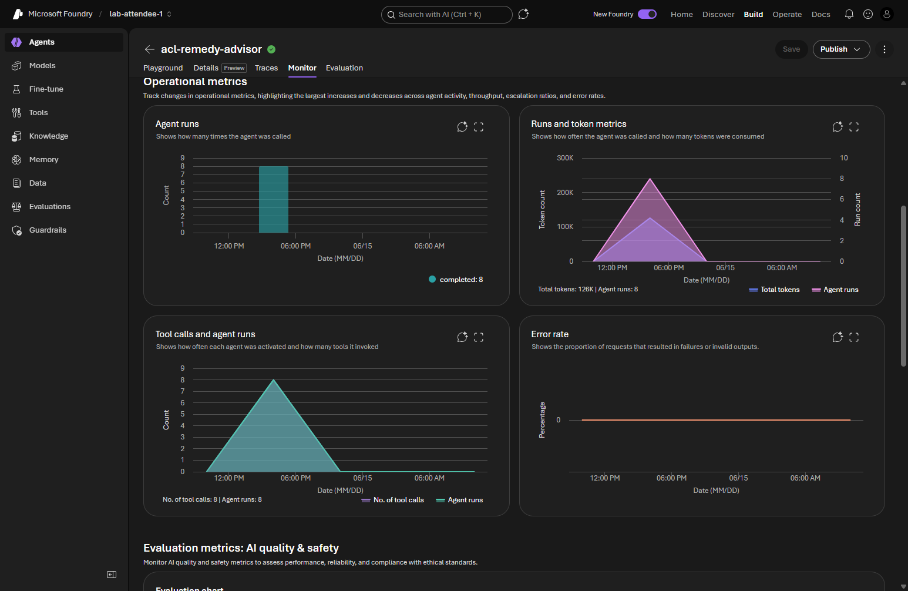

  

- [ ] Interpret the key metrics:

  | Chart or card | What it tells you |
  |---|---|
  | **Estimated cost** & **Total token usage** (summary cards) | Headline cost and token totals for agent traffic over the selected range; high token usage can indicate verbose prompts or responses. |
  | **Agent runs** | How many runs the agent handled and how that volume trends over time. |
  | **Runs and token metrics** | Run counts correlated with token consumption, so you can spot runs that are unusually expensive. |
  | **Tool calls and agent runs** | Tool-call volume relative to runs, showing how heavily the agent relies on its tools. |
  | **Error rate** | Share of runs that failed; a rising error rate warrants investigating failed runs. |
  | **Evaluation chart** | Scores produced by evaluators on sampled outputs (populated once continuous evaluation is enabled). |

- [ ] Call out that **continuous evaluation** and **red team** scans are important operational safeguards and can be set up here (the **Settings** button opens **Monitor settings**). You configure them in the [extra-credit section](#part-7-extra-credit--configure-evaluations-scheduled-evaluations-and-red-teaming) below.

  > [!NOTE]
  > [Continuous evaluation](https://learn.microsoft.com/azure/ai-foundry/concepts/evaluation-evaluators-metrics) provides near real-time quality and safety scores on sampled traffic and links results back to traces for root-cause analysis. Red team scans use the [AI Red Teaming Agent](https://learn.microsoft.com/azure/ai-foundry/concepts/ai-red-teaming-agent) (built on Microsoft's [PyRIT](https://github.com/Azure/PyRIT) framework) to simulate adversarial probing and surface safety risks such as data leakage or prohibited actions.

### Part 4 — Repeat for the hosted agent

> [!NOTE]
> This is the hosted agent you built in [Module 09](../09-hosted-agents/README.md), named `acl-remedy-advisor-hosted-code`. If you deployed it under a different name, substitute that name wherever this module refers to the hosted agent.

- [ ] Open `acl-remedy-advisor-hosted-code` under **Build → Agents**.
- [ ] On the **Details** tab, open the **Identity & access** section and locate its **Entra agent identity**. Because a hosted agent has its own application resource, it has a [**distinct agent identity and blueprint**](https://learn.microsoft.com/entra/agent-id/agent-blueprint) — confirm its **ID** differs from the `acl-remedy-advisor` identity you noted in Part 1, and notice that the hosted agent's identity and blueprint are shown as links to their registered application in Azure.

  

  
📸 Screenshot: Hosted agent's distinct Entra agent identity

  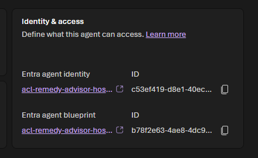

  

- [ ] On the **Traces** tab, review its conversations and responses the same way as in Part 2. (For a hosted agent, the second sub-tab may be labeled **Sessions** rather than **Responses**.)
- [ ] On the **Monitor** tab, review its operational metrics and evaluation scores the same way as in Part 3.
- [ ] Note how the distinct identity isolates the hosted agent's permissions, auditability, and telemetry from the in-development agents in the project.

### Part 5 — The Operate control plane

- [ ] Select **Operate** in the top navigation.
- [ ] Review how the Foundry **control plane** aggregates health and metrics across agents in your subscription using their connected Application Insights resources.

  

  
📸 Screenshot: Operate control plane

  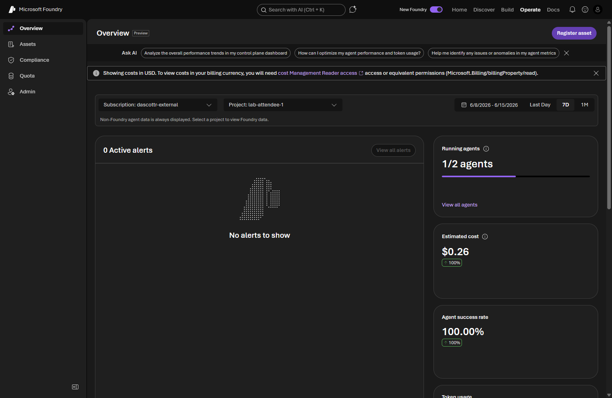

  

- [ ] Note that the control plane covers prompt-based agents, workflows, **hosted agents**, and manually registered custom agents — giving you a single place to monitor a fleet rather than one agent at a time.

  > [!NOTE]
  > Different users may see different agents depending on their access. Learn more in [Monitor agent health and performance across your fleet](https://learn.microsoft.com/azure/ai-foundry/control-plane/monitoring-across-fleet).

### Part 6 — The Agents view in Application Insights

- [ ] Open the [Azure portal](https://portal.azure.com) and navigate to the **Application Insights** resource connected to your Foundry project.

  > [!TIP]
  > You can find the exact resource name in Foundry under **Monitor → Settings** (the **Application Insights resource** row). In this workshop it is named like `appi-<environment>`.

- [ ] Under **Investigate**, open the **Agents (preview)** view.
- [ ] Explore what this unified view surfaces for AI agents:
  - [ ] Agent performance and run activity.
  - [ ] Token usage and estimated cost.
  - [ ] Errors and failures to troubleshoot.

  

  
📸 Screenshot: Agents (preview) view in Application Insights

  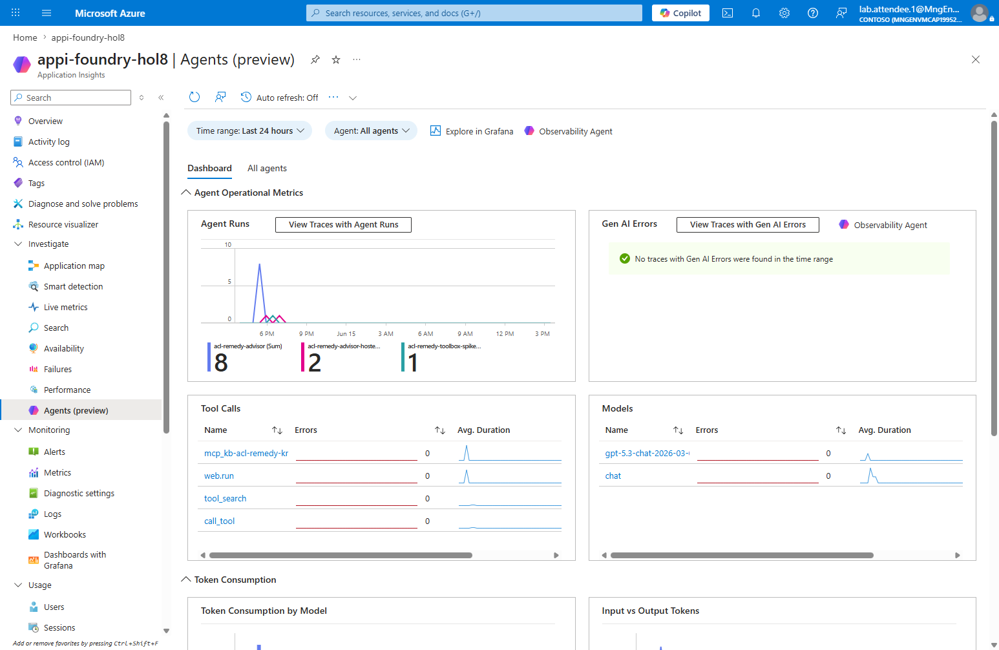

  

- [ ] Note that this view consolidates telemetry across sources (Foundry, Copilot Studio, and third-party agents) and is based on [OpenTelemetry Generative AI semantic conventions](https://opentelemetry.io/docs/specs/semconv/gen-ai/). Use the **Search** view to inspect individual conversations when full prompt capture is enabled. Because Application Insights retains historical telemetry, this view may also list agents that are no longer present in your Foundry project.

  > [!NOTE]
  > Learn more in [Monitor AI agents with Application Insights](https://learn.microsoft.com/azure/azure-monitor/app/agents-view).

### Part 7 (extra credit) — Configure evaluations, scheduled evaluations, and red teaming

> [!IMPORTANT]
> Creating evaluation and red-team configurations changes project settings and typically requires the **`foundry-project-manager`** role or higher. If you have the `foundry-user` role, read through this part without applying changes, or ask your organizer to elevate your role.

- [ ] Return to the **Monitor** tab for `acl-remedy-advisor` and select the **Settings** button (next to **Open in Azure Monitor**) to open **Monitor settings**.

  

  
📸 Screenshot: Monitor settings

  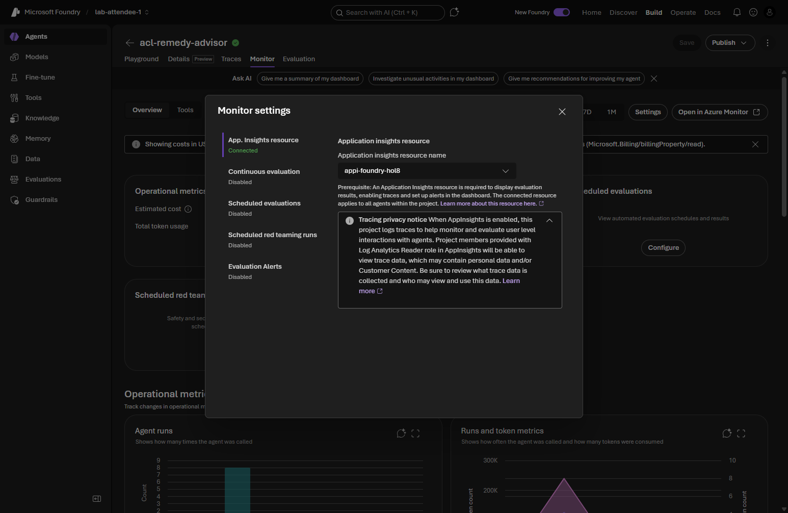

  

- [ ] Configure the settings that control which charts appear and which evaluations run:

  | Setting | Purpose | Options |
  |---|---|---|
  | Application Insights resource | The connected resource that stores the agent's traces, metrics, and evaluation results. | Shown as **Connected** when telemetry is wired up (provisioned by the workshop infrastructure). |
  | [Continuous evaluation](https://learn.microsoft.com/azure/ai-foundry/concepts/evaluation-evaluators-metrics) | Runs evaluators on sampled agent responses in near real time. | Enable/disable, add evaluators, set the sample rate. |
  | [Scheduled evaluations](https://learn.microsoft.com/azure/ai-foundry/how-to/online-evaluation) | Runs evaluations on a schedule to validate performance against benchmarks. | Enable/disable, select an evaluation template and run, set a schedule. |
  | [Scheduled red teaming runs](https://learn.microsoft.com/azure/ai-foundry/concepts/ai-red-teaming-agent) | Runs adversarial tests to detect risks such as data leakage or prohibited actions. | Enable/disable, select an evaluation template and run, set a schedule. |
  | Evaluation Alerts | Detects performance anomalies, evaluation failures, and security risks. | Configure alerts for latency, token usage, evaluation scores, or red-team findings. |

- [ ] Enable **continuous evaluation**, add one or more evaluators, and set a modest sample rate so the **Monitor** and **Traces** tabs begin showing evaluation scores.
- [ ] Configure a **scheduled evaluation** against a saved evaluation run to track quality over time.
- [ ] Configure a **scheduled red team scan** to probe the agent for safety risks on a recurring basis.

  > [!NOTE]
  > These features can also be configured with the Python SDK. See the [continuous evaluation rule sample](https://github.com/Azure/azure-sdk-for-python/blob/main/sdk/ai/azure-ai-projects/samples/evaluations/sample_continuous_evaluation_rule.py) and the [scheduled evaluations and red teaming sample](https://github.com/Azure/azure-sdk-for-python/blob/main/sdk/ai/azure-ai-projects/samples/evaluations/sample_scheduled_evaluations.py), and the dashboard guide [Monitor agents with the Agent Monitoring Dashboard](https://learn.microsoft.com/azure/ai-foundry/observability/how-to/how-to-monitor-agents-dashboard).

## Validation

- You can locate the **Entra agent identity** and blueprint on the **Details** tab for both agents and explain that each agent has its own named identity, with the hosted agent's identity and blueprint isolated in its own agent application resource.
- You can open **Traces → Conversations** for both agents, read the run columns, and drill into a single trace.
- You can read the **Monitor** dashboard metrics and locate where continuous evaluation and red team scans are configured.
- You can open the **Operate** control plane and the **Agents (preview)** view in Application Insights.
- *(Extra credit)* You configured continuous evaluation, a scheduled evaluation, and a scheduled red team scan from **Monitor settings**.

## Congratulations 🎉

You looked at your agents through an operations and identity lens. You found the Entra agent identity and blueprint that tie an agent's configuration, runs, and access together, compared each agent's named identity and saw how a hosted agent's identity and blueprint are isolated in its own application resource, walked the Traces and Monitor tabs for both agents, toured the Operate control plane and the Application Insights Agents view, and saw where continuous evaluation and red teaming are configured — the foundations of running agents reliably and governing them in production.

> [!TIP]
> **Next up → [Module 12: Publish an agent](../12-publishing-agents/README.md)**
> Publish your agent so consumers can discover and use it. No need to scroll — jump straight in!

## Troubleshooting

- If the **Traces** or **Monitor** views are empty, confirm the agent has been run at least once, expand the time range, and refresh after a few minutes for ingestion delay.
- If you see authorization errors viewing telemetry, confirm your account has read access to the connected Application Insights resource — querying logs requires the [Log Analytics Reader](https://learn.microsoft.com/azure/azure-monitor/logs/manage-access?tabs=portal#log-analytics-reader) role.
- If continuous evaluation results do not appear, confirm the rule is enabled, that agent traffic is flowing, and that the project managed identity has the **Foundry User** role.
- If the **Details** tab or evaluation settings are unavailable, confirm your role grants the required access to the project (`foundry-project-manager` or higher for configuration changes).
- If the hosted agent is missing, complete [Module 09](../09-hosted-agents/README.md) first, then return here.
