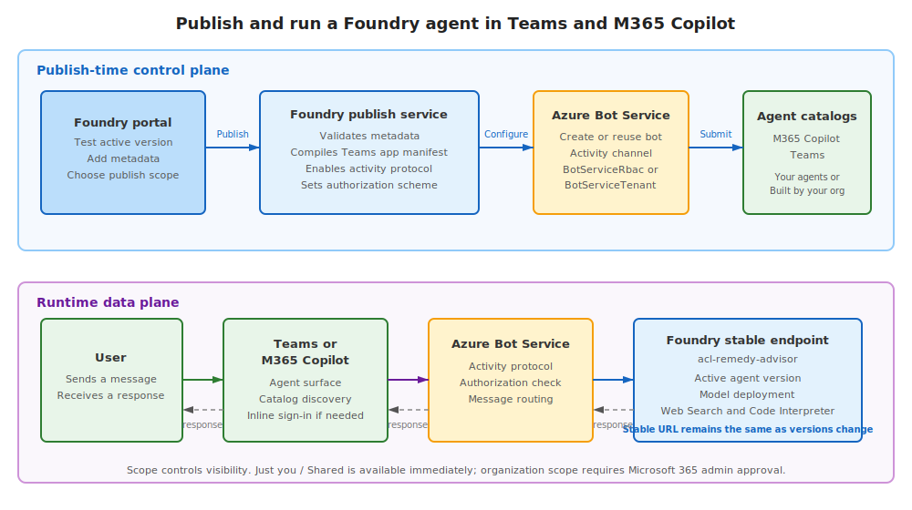
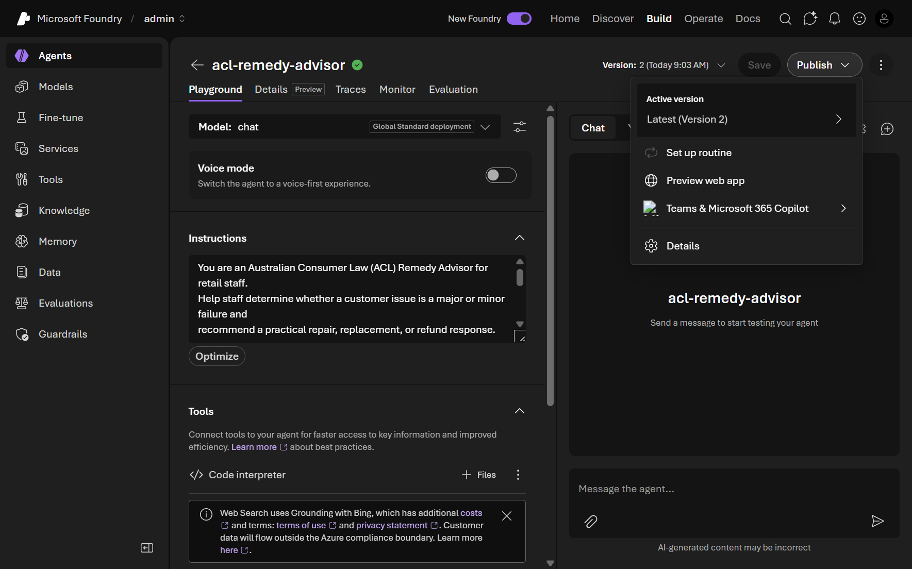
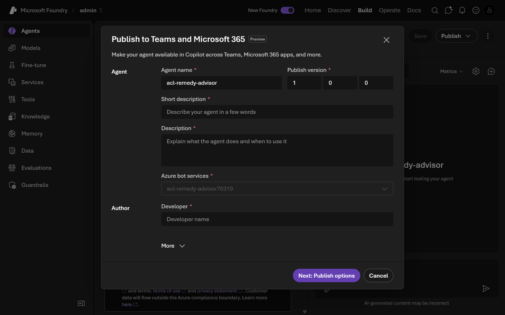
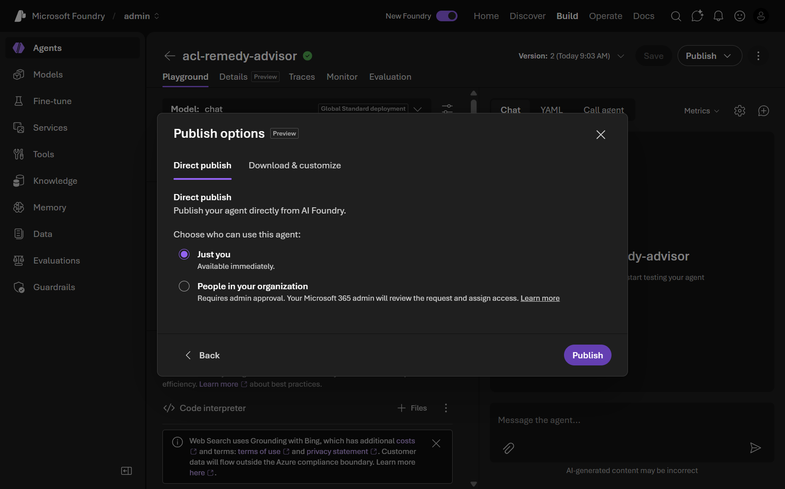
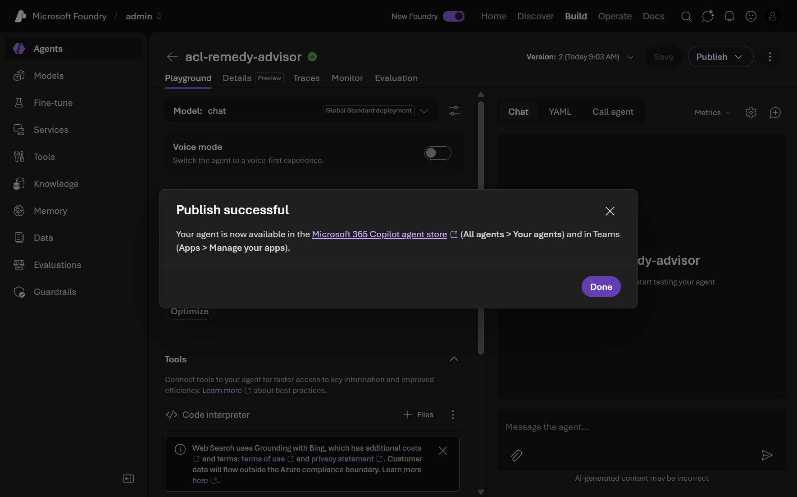
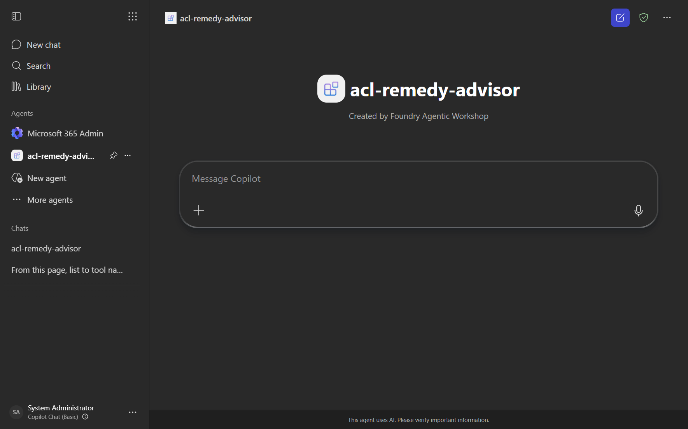
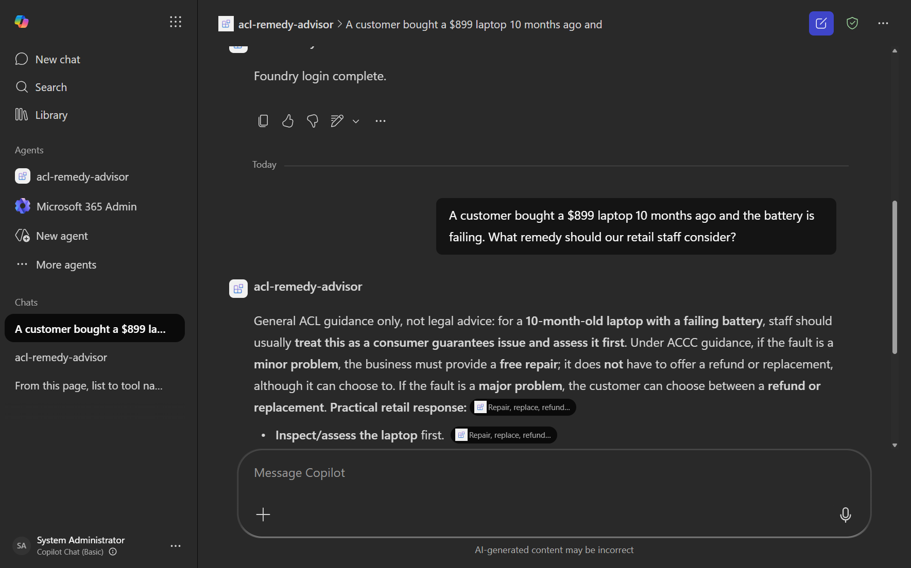

# 12. Publish an agent (optional)



<!-- markdownlint-disable MD028 -->
> [!IMPORTANT]
> This module requires the **`foundry-project-manager`** role or higher. Attendees assigned the `foundry-user` role cannot publish agents and will not be able to complete this module. Ask your organizer to confirm your role before proceeding. Organizers: set `AZURE_ATTENDEE_DEFAULT_ROLE=foundry-project-manager` (the recommended default) or grant individual attendees the `foundry-project-manager` role.

**Estimated time:** 25 minutes

> [!IMPORTANT]
> This module requires the **`foundry-project-manager`** role or higher. Attendees assigned the `foundry-user` role cannot publish agents and will not be able to complete this module. Ask your organizer to confirm your role before proceeding. Organizers: set `AZURE_ATTENDEE_DEFAULT_ROLE=foundry-project-manager` (the recommended default) or grant individual attendees the `foundry-project-manager` role.

> [!TIP]
> Tick the checkbox next to each step as you complete it to track your progress through this module.
<!-- markdownlint-enable MD028 -->

## Objectives

- Understand when and why agents are published.
- Publish the `acl-remedy-advisor` agent to Microsoft 365 Copilot and Microsoft Teams.
- Verify the published agent in Microsoft Teams and send it a test message.
- Understand the different paths for standard publishing, virtual-network publishing, and Microsoft Agent 365 autopilots.

## Concepts

### What publishing does

Publishing exposes the agent's stable endpoint to Microsoft 365 Copilot and Teams. Foundry creates or reuses an Azure Bot Service resource, enables the activity protocol, builds the Teams app package, and submits it to the Microsoft 365 and Teams agent catalogs.

The portal's **Just you** option is the safest choice for this workshop. It uses the `Shared` publish scope, makes the agent available immediately under **Your agents**, and does not require Microsoft 365 administrator approval. The **People in your organization** option uses the `Tenant` scope and requires an administrator to approve the request before the agent appears under **Built by your org**.

> [!WARNING]
> Publishing is an Early Access Preview. Do not include secrets, API keys, customer data, or other sensitive information in the agent's display metadata.

### Virtual-network publishing

The portal flow in this module is for projects that can be reached through the standard public endpoint. If a Foundry project has public network access disabled and uses a private endpoint, the portal publishing flow is unavailable. The [REST API publishing flow](https://learn.microsoft.com/azure/foundry/agents/how-to/publish-copilot-virtual-network) can publish the agent, but it also requires a publicly reachable entry point, TLS termination, DNS and routing, and carefully restricted inbound and outbound network traffic. This module mentions that path for architectural awareness; it does not configure or use it.

### Microsoft Agent 365 autopilots

An autopilot is a separate Microsoft Agent 365 workflow for publishing a **Hosted agent** and submitting its agent blueprint for Microsoft 365 administrator approval. After approval, the agent can be registered and instantiated from Teams. The [Microsoft Agent 365 autopilot workflow](https://learn.microsoft.com/azure/foundry/agents/how-to/agent-365) uses a different deployment and approval path, so this module does not create an autopilot. The normal publish request uses `publishAsAutopilot: false`.

## Steps

### Part 1 - Prepare the agent and permissions

#### 1. Confirm the agent and Azure permissions

- [ ] Sign in to [Microsoft Foundry](https://ai.azure.com) with the same account and tenant used by `az login`.
- [ ] Confirm the `acl-remedy-advisor` agent exists in the project and has a tested active version. If you skipped the earlier agent modules, run `solution/create_agent.py` from this module first.
- [ ] Confirm that the `Microsoft.BotService` resource provider is registered in the subscription:

  ```powershell
  az provider register --namespace Microsoft.BotService
  ```

- [ ] Confirm that your identity has permission to create and configure an Azure Bot Service resource in the target resource group. The **Azure Bot Service Contributor** role, **Contributor**, or **Owner** is sufficient.

#### 2. Review the active version

- [ ] In Foundry, select **Build**, open `acl-remedy-advisor`, and select **Details**.
- [ ] In **Agent configuration**, review **Active version**. Select **Edit** if you need to select **Always use latest** or a specific tested version.
- [ ] Confirm the model, instructions, tools, and knowledge configuration are the version you intend to expose to Teams.

### Part 2 - Publish from Foundry

#### 3. Open the publishing flow

- [ ] Select **Publish**, then select **Teams and Microsoft 365 Copilot**.

  <details>
  <summary>📸 Screenshot: Open the Teams and Microsoft 365 Copilot publish flow</summary>

  

  </details>

- [ ] Confirm that the **Publish to Teams and Microsoft 365** dialog opens.
- [ ] Confirm the **Azure Bot Service** resource is shown. Foundry creates it automatically when needed or displays the existing resource as read-only.

#### 4. Complete the agent metadata

- [ ] Enter the display metadata. Use values similar to these, changing the developer name to your own organization or name:

  | Field | Value |
  |---|---|
  | Name | `ACL Remedy Advisor` |
  | Publish version | `1.0.0` |
  | Short description | `Helps retail staff determine the right remedy for product problems under Australian Consumer Law.` |
  | Description | `Provides practical, general guidance for retail staff about repairs, replacements, and refunds under Australian Consumer Law. It uses the configured agent tools and knowledge to support the recommendation.` |
  | Developer | Your name or organization name |

- [ ] Expand **More** only if you have HTTPS URLs for a developer website, terms of use, or privacy statement. Do not enter placeholder URLs or sensitive information.

  <details>
  <summary>📸 Screenshot: Publish metadata form</summary>

  

  </details>

- [ ] Select **Next: Publish options**.

#### 5. Choose the publish scope

- [ ] Select the **Direct publish** tab.
- [ ] Under **Choose who can use this agent**, select **Just you**.
- [ ] Confirm that this choice corresponds to the `Shared` scope: the agent is immediately available to you under **Your agents**, and Microsoft 365 administrator approval is not required.

  <details>
  <summary>📸 Screenshot: Direct publish with Just you selected</summary>

  

  </details>

#### 6. Publish the agent

- [ ] Select **Publish** and wait for the confirmation dialog.
- [ ] Confirm that **Publish successful** is displayed.

  <details>
  <summary>📸 Screenshot: Publish successful confirmation</summary>

  

  </details>

### Part 3 - Verify the agent in Microsoft Teams

#### 7. Open the agent store

- [ ] Open Microsoft Teams in your browser or desktop client and sign in to the tenant you are using for this workshop.
- [ ] Open **Apps** and search for `ACL Remedy Advisor`.
- [ ] Open the agent from **Your agents**. The **Just you** scope means other users will not see it in their agent stores.

  <details>
  <summary>📸 Screenshot: Agent in the Teams store</summary>

  

  </details>

#### 8. Send a test message

- [ ] Start a new conversation with the agent.
- [ ] Send this message: `A customer bought a $899 laptop 10 months ago and the battery is failing. What remedy should our retail staff consider?`
- [ ] Confirm that the agent replies. A successful reply verifies the published channel can reach the agent and return its response.
- [ ] If this is the first conversation for your account, the agent might first show an inline **Open sign-in link** message. Open the link and complete the Microsoft sign-in if prompted. Return to the conversation and wait for **Foundry login complete** before checking the final answer.

  <details>
  <summary>📸 Screenshot: Agent conversation in Teams</summary>

  

  </details>

#### 9. Understand updates and troubleshooting

- [ ] Note that changing the active agent version changes the version served through the stable published endpoint; you do not normally need to publish again for an agent version update.
- [ ] Note that changing the display name, descriptions, or URLs requires the **Update agent Teams and Microsoft 365 Copilot display properties** action from the **Publish** menu.
- [ ] If the agent does not appear immediately, refresh or reopen the store. Store results can be cached.

## Validation

- The agent shows a published state after the publish action.
- You can locate the published agent's connection or consumption details.
- The Foundry dialog reports **Publish successful**.
- The agent appears under **Your agents** in Teams.
- The agent replies to the test message in a new Teams conversation.
- You can explain why the REST virtual-network flow and Microsoft Agent 365 autopilot flow are separate from this portal exercise.

## Congratulations 🎉

You published an agent and located its connection and consumption details - the final step in taking an agent from idea to something real consumers can use. That completes the full end-to-end journey: setup, prompt and hosted agents, tools, MCP, Foundry IQ, the Agent Framework, Toolboxes, operations, and publishing. Outstanding work! 🚀
You published `acl-remedy-advisor` to Microsoft 365 Copilot and Teams and verified a live conversation. That completes the workshop journey from setup and agent construction through tools, knowledge, operations, and publishing.

> [!TIP]
> **You finished the workshop! → [Back to the workshop overview](../README.md)**
> Revisit any module from the overview, or take everything you've built into your own projects. No need to scroll - explore from here!
> [!TIP]
> **Go further → [Module 13: Build a custom engine agent](../13-custom-engine-agent/README.md)**
> Build an attendee-owned Microsoft 365 Agents SDK proxy that connects Teams to the Foundry agent. This optional module requires your own Azure subscription and Entra tenant.

## Troubleshooting

| Symptom | Fix |
|---|---|
| Publish is unavailable | Confirm the project role is **Foundry Project Manager** or higher, and that the agent has a tested active version. |
| Azure Bot Service creation fails | Confirm the `Microsoft.BotService` provider is registered and your identity has Azure Bot Service Contributor, Contributor, or Owner on the resource group. |
| The agent does not appear in Teams | Confirm you used **Just you**, reopen or refresh the agent store, and allow time for catalog propagation. Organization scope requires administrator approval. |
| The agent appears but does not reply | Confirm the agent identity has access to every Azure resource used by its tools. Start a new conversation if the current conversation is stuck. |
| `NotImplementedException` | The starter file is intentionally a portal-only placeholder. Follow the README steps, or run the solution helper when you need to recreate the agent. |
