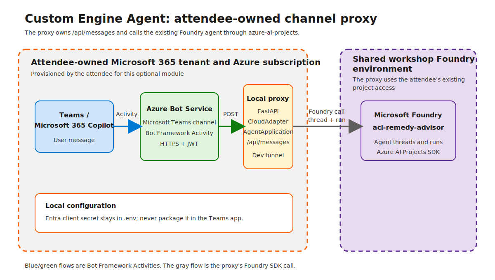
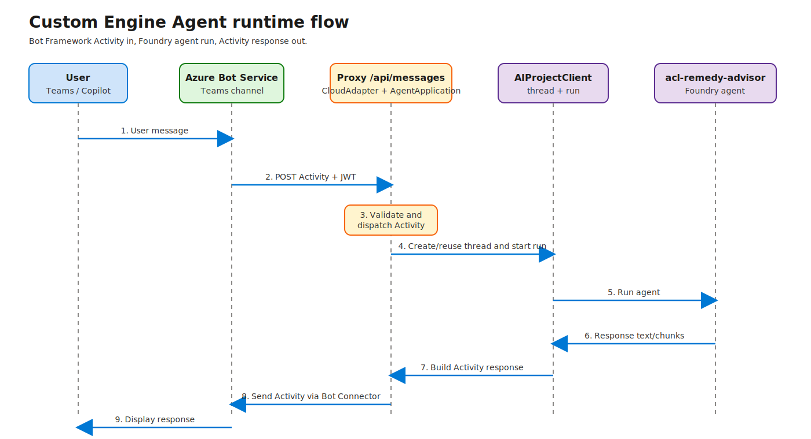

# 13. Build a custom engine agent (optional, extra credit)

**Estimated time:** 60 minutes



> [!IMPORTANT]
> This is an optional, extra-credit module. The hands-on path requires your **own Azure subscription** and Microsoft Entra tenant. You need permission to create an app registration and an Azure Bot Service resource. The shared workshop tenant does not grant these permissions and is not used by this module.

<!-- markdownlint-disable-next-line MD028 -->
> [!TIP]
> Tick the checkbox next to each step as you complete it. If you do not have access to another Azure subscription and tenant, follow along with the facilitator demonstration instead.

## Objectives

- Explain how a Custom Engine Agent differs from the native Foundry publishing flow in Module 12.
- Provision the identity and Azure Bot Service resources needed by a Microsoft 365 Agents SDK proxy.
- Run a FastAPI proxy locally and expose it to Microsoft 365 through a development tunnel.
- Package and sideload the proxy as a custom Teams app.
- Send a message through Teams and confirm that the existing `acl-remedy-advisor` Foundry agent responds.

## Concepts

### Native publishing and Custom Engine Agents

Module 12 uses Foundry's **Publish** flow. Foundry owns the public endpoint, the Azure Bot Service integration, and the bridge between the Microsoft 365 Activity protocol and the agent's Foundry protocol.

This module uses the Custom Engine Agent pattern. Your application owns the bot endpoint and the orchestration code. Azure Bot Service forwards Bot Framework Activity messages to the proxy's `POST /api/messages` route. The proxy uses the Microsoft 365 Agents SDK to authenticate and dispatch the Activity, then calls the existing `acl-remedy-advisor` agent through `azure-ai-projects`.



The two paths are intentionally different:

| Module 12 | Module 13 |
|---|---|
| Foundry-managed publishing endpoint | Attendee-owned proxy endpoint |
| Foundry manages the Activity-to-Responses bridge | The proxy translates between Activity and Foundry calls |
| Agent configuration remains in Foundry | The proxy owns the web host, identity configuration, and request handling |
| Requires publishing permissions in the workshop project | Requires an attendee-owned tenant and subscription |

### Microsoft 365 Agents SDK and Microsoft Agent Framework

The proxy uses the **Microsoft 365 Agents SDK**. Its `CloudAdapter` validates Bot Framework requests and its `AgentApplication` dispatches Activities to the message handler. It is not a Microsoft Agent Framework application. Microsoft Agent Framework is used in other workshop modules for agent orchestration; this module uses the SDK designed for Microsoft 365 agent channel integration.

### Activity protocol and `/api/messages`

Azure Bot Service sends an authenticated HTTP `POST` request to `/api/messages`. The request body is a Bot Framework Activity represented as JSON. The `Authorization` header contains a Bot Framework JWT that the proxy validates with the Entra app registration configured for the bot.

The proxy sends replies through the `CloudAdapter`, which calls the Bot Connector. Teams and Microsoft 365 Copilot receive those replies as Activity messages. The proxy does not expose a Foundry Hosted Agent `/responses` endpoint: it is a normal web application that owns the `/api/messages` route.

### Resource ownership

The Azure Bot Service and Entra app registration are created in your own tenant and subscription. The proxy uses your local Azure CLI sign-in to call the shared workshop Foundry project endpoint, so your identity must also retain access to `acl-remedy-advisor`. The local client secret is used by the Bot Framework adapter and must stay in your local `.env` file.

## Steps

### Part 1 - Confirm access and prepare the code

#### 1. Confirm the optional-module prerequisites

- [ ] Confirm that you have an Azure subscription and Microsoft Entra tenant where you can create an app registration and an Azure Bot Service resource.
- [ ] Confirm that `FOUNDRY_PROJECT_ENDPOINT` points to the workshop project and that `acl-remedy-advisor` is available.
- [ ] Confirm that you are signed in to the correct Azure tenant:

  ```powershell
  az login
  az account show --query "{subscription:id, tenant:tenantId, user:user.name}" -o table
  ```

- [ ] Install the Microsoft 365 Agents Toolkit CLI (`atk`) if you want to use its scaffolding or sideload helpers. Manual Teams upload is the supported path in this module and does not require `atk`.

#### 2. Review the sample layout

- [ ] Open `src/main.py`, `src/agent.py`, and `src/start_server.py`.
- [ ] Review the completed implementation in `solution/` before filling in the starter TODOs.
- [ ] Install the optional Module 13 dependencies:

  ```powershell
  uv sync --group module-13
  ```

### Part 2 - Provision the bot identity and Azure Bot Service

#### 3. Create the Entra app and Bot Service

- [ ] Choose a resource-group name in your own subscription. The provisioning script creates it when it does not exist.
- [ ] Set the deployment values in your local shell or `.env` file:

  ```powershell
  $env:BOT_SERVICE_NAME = 'acl-remedy-advisor-cea'
  $env:BOT_RESOURCE_GROUP = 'rg-acl-remedy-advisor-cea'
  $env:BOT_LOCATION = 'australiaeast'
  ```

- [ ] Leave `BOT_MESSAGING_ENDPOINT` unset until the development tunnel is running, then run:

  ```powershell
  uv run python labs/introduction-foundry-agent-service/13-custom-engine-agent/solution/provision_bot_service.py
  ```

- [ ] Copy the printed local configuration into `.env`. Never commit the client secret.

### Part 3 - Run the proxy and expose it through a development tunnel

#### 4. Start the local proxy

- [ ] Complete the TODOs in `src/` or run the solution directly:

  ```powershell
  uv run python labs/introduction-foundry-agent-service/13-custom-engine-agent/solution/start_server.py
  ```

- [ ] Confirm that the application listens on `http://localhost:3978` and exposes `POST /api/messages`.

#### 5. Create a development tunnel

- [ ] Create a public HTTPS tunnel to port 3978 using the development-tunnel tooling available in your environment.
- [ ] Set `BOT_MESSAGING_ENDPOINT` to the tunnel URL followed by `/api/messages`.
- [ ] Re-run the provisioning script if the Bot Service messaging endpoint needs to be updated.
- [ ] Keep the proxy and tunnel running while testing in Teams. A tunnel URL change requires another Bot Service update.

### Part 4 - Package and sideload the Teams app

#### 6. Update and package the manifest

- [ ] Set the bot ID in `appPackage/manifest.json` to the app ID printed by the provisioning script.
- [ ] Review the manifest's bot scopes and display metadata.
- [ ] Create a ZIP file containing `manifest.json` and the referenced icons. Do not include `.env` or any secret.

#### 7. Upload the custom app

- [ ] Open Microsoft Teams in the tenant associated with your Entra app.
- [ ] Open **Apps**, select **Manage your apps**, and choose **Upload a custom app**.
- [ ] Upload the ZIP package and open the resulting `ACL Remedy Advisor` app.

### Part 5 - Send a test message

#### 8. Verify the end-to-end conversation

- [ ] Send this message to the app:

  ```text
  A customer returned a $1,200 fridge that stopped cooling after 14 months. What remedy should we offer under the Australian Consumer Law?
  ```

- [ ] Confirm that the local proxy logs an incoming Activity and a response.
- [ ] Confirm that Teams displays the response from `acl-remedy-advisor`.
- [ ] Stop the proxy and send another message. Confirm that the failure is observable, then restart the proxy before continuing.

## Validation

- The Entra app registration and Bot Service exist in the attendee-owned resource group.
- The proxy starts locally without exposing a secret in the console or source code.
- `POST /api/messages` accepts Bot Framework Activity requests when the Bot Service sends them.
- The Teams custom app opens and delivers the test message to the local proxy.
- The response is grounded by the existing `acl-remedy-advisor` Foundry agent.
- You can explain why this proxy is different from the Foundry-managed publishing bridge in Module 12.

## Congratulations 🎉

You built a Custom Engine Agent integration: Microsoft 365 sends Activity messages to your own proxy, and the proxy connects those messages to a Microsoft Foundry agent. This pattern gives you control of the channel-facing application while keeping the agent configuration and grounding in Foundry.

> [!TIP]
> **Go further → [Module 13: Build a custom engine agent](../13-custom-engine-agent/README.md)**
> Compare this custom proxy path with the native Foundry publishing flow and return to the workshop overview when you are ready.

## Troubleshooting

| Symptom | Fix |
|---|---|
| `AuthenticationFailedException` when the proxy starts | Confirm the Bot Service app ID, tenant ID, and client secret are set in the local environment. Create a new secret if the previous one expired. |
| Bot Service reports an invalid messaging endpoint | Use an HTTPS tunnel URL ending in `/api/messages`. Confirm that the tunnel forwards to port 3978 and is still running. |
| Teams app upload is blocked | Confirm that custom app upload is enabled by your tenant policy, or ask a Teams administrator to upload the package. |
| The proxy receives no Activity | Confirm the Bot Service channel is enabled, the messaging endpoint is public HTTPS, and the local proxy is running. |
| The proxy responds but Foundry fails | Run `az account show`, verify `FOUNDRY_PROJECT_ENDPOINT`, and confirm your signed-in identity can access the workshop project. |
| `NotImplementedException` | A starter TODO is still incomplete. Compare the file with the matching implementation in `solution/`. |
